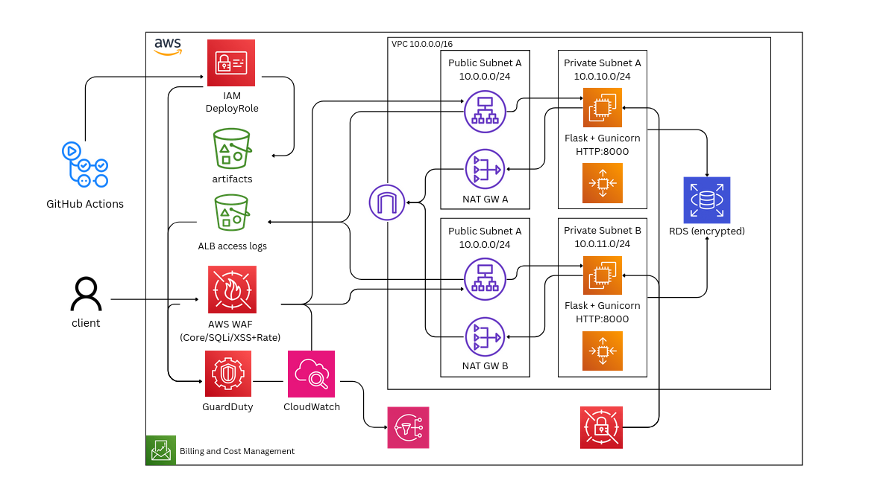

# Secure Web Application Deployment on AWS


This repository provides a production-grade template for deploying a secure web application on AWS using **Infrastructure as Code (IaC)**, **CI/CD with GitHub Actions**, and **defense-in-depth security controls**.  
It was designed as both a learning project and a reusable template for cloud security best practices.

**Security Considerations**

- No static AWS credentials stored in GitHub.  
- Encrypted communication enforced (TLS, HTTPS).  
- IAM policies scoped with least privilege.  
- Only ALB is public; EC2 runs in private subnets.  

📄 [Read the full report](./docs/report.md)

---

### How to Use

1. Clone the repository.
2. Deploy with:
    ```bash
    export ACM_ARN=""  # optional for HTTP tests
    chmod +x deploy.sh
    ./deploy.sh
    ```

3. To destroy all resources created:
    ```bash
    ./destroy.sh
    ```

⚠️ Always verify that resources have been fully removed after running these scripts. Some resources (e.g., NAT Gateways, Load Balancers, WAF, or S3 buckets) may continue to incur costs if left behind.

No responsibility is assumed for ongoing charges, it is the user’s responsibility to confirm that all billable resources have been terminated.
<details>

## Architecture



## 🚀 Features

- **Infrastructure as Code (CloudFormation)**
  - VPC with public/private subnets across multiple AZs.
  - Application Load Balancer (ALB) with TLS termination.
  - Private EC2 instances running a Flask app with IMDSv2 enforced.
  - Encrypted EBS volumes enabled by default.
  - Security groups applying least-privilege network access.

- **Security Best Practices**
  - [OWASP] HTTP headers (X-Frame-Options, X-Content-Type-Options).
  - [CIS AWS Benchmark] IMDSv2 enforced, no public IPs on EC2.
  - [IAM] OIDC federation with GitHub Actions, no long-lived keys.
  - [CI/CD] Branch protection and status checks required for `main`.
  - Encrypted S3 artifact bucket with lifecycle rules.

- **CI/CD Pipeline**
  - Linting, testing, and packaging with GitHub Actions.
  - Secure artifact upload to S3.
  - Deployment to EC2 instances via AWS Systems Manager (SSM).
  - Infrastructure scanning with Checkov (SARIF reports optional).

## ✅ Validation
- Health checks available at `/health` endpoint.  
- Logs streamed to CloudWatch.  
- CI/CD pipeline tested with PRs and protected branch rules.  
- Manual deployment validated via SSM (no SSH required).  

## 🧹 Cleanup

To avoid unexpected AWS charges, all resources created by this project can be deleted using the provided cleanup scripts:

```bash
./destroy.sh
```

## Others

The policies are not yet pushed to the repository.
- [License](./LICENSE)

</details>