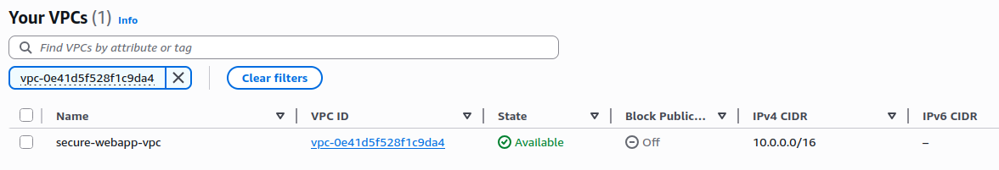
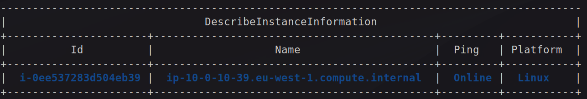

# Secure Web App on AWS EC2
8 Day Project Plan

### Day 1 – Planning & IaC Basics
    ✅Define the application scope (Flask Python web app) and security objectives.
    ✅Design the AWS architecture:
    - EC2 instance inside a private subnet 
    - Public access via an Application Load Balancer (ALB)
    - Security Groups and VPC configuration
    ✅Create the base CloudFormation template for VPC, subnets, Internet Gateway, and Security Groups.

### Day 2 – EC2 Deployment via CloudFormation
    ✅Extend CloudFormation to:
        Launch an EC2 instance with Amazon Linux 2
        Attach IAM role with least privilege for SSM and CloudWatch
        Create and associate an Elastic IP (optional)
    Validate deployment and connectivity (restricted by IP).

### Day 3 – Flask Application Setup
    ✅Install Python, Flask, and dependencies on EC2.
    ✅Create a simple Flask app with:
        / route for home
        /health endpoint for monitoring
    ✅Test locally on the EC2 instance.

### Day 4 – Network Security
    ✅Lock down Security Groups:
        Allow inbound HTTP/HTTPS only from ALB or your IP.
        Restrict SSH to your IP only.
    Configure VPC to ensure EC2 is in a private subnet with NAT gateway for outbound traffic.
    Enable AWS WAF on the ALB with OWASP Top 10 rules.

### Day 5 – Python Automation
    ✅Write a user data script or Ansible/SSM document to:
        Install Python, dependencies, and Flask
        Configure systemd service for Flask app
        Set up Nginx reverse proxy with SSL (ACM certificate via ALB)
    Deploy automation through CloudFormation.
      ⚠️ was done manually at the moment.

### Day 6 – CI/CD with GitHub Actions
    ✅Create GitHub Actions workflow:
        Lint Python code (flake8 / black)
        Run unit tests
        Package app
        Deploy to EC2 via SSM or CodeDeploy (no SSH keys, OIDC IAM role)
    ✅Add branch protection to main.

### Day 7 – CloudWatch Monitoring
    Enable CloudWatch Logs for Flask app and Nginx.
    Set up CloudWatch Alarms for:
        High CPU usage
        HTTP 5xx errors from ALB
    Create SNS topic for alerts (email notification).

### Day 8 – Security Validation & Documentation
    Test:
        Blocked direct EC2 access
        WAF rules triggering
        IAM role least privilege
        CI/CD deployment success
    Write README.md and full security report with:
        Architecture diagram
        Security controls implemented
        Lessons learned

---

## Day 1
- created the git repository
- yml files - lint.yml
- app.py with Flask app and Security headers

Tested the minimal Flask app locally:
```bash
curl -s http://127.0.0.1:8000/health | jq
curl -i http://127.0.0.1:8000/ | sed -n '1,20p'   # show headers
{
  "status": "ok"
}
  % Total    % Received % Xferd  Average Speed   Time    Time     Time  Current
                                 Dload  Upload   Total   Spent    Left  Speed
100    64  100    64    0     0  21805      0 --:--:-- --:--:-- --:--:-- 32000
HTTP/1.1 200 OK
Server: Werkzeug/3.1.3 Python/3.10.12
Date: Mon, 11 Aug 2025 21:31:34 GMT
Content-Type: application/json
Content-Length: 64
X-Frame-Options: DENY
X-Content-Type-Options: nosniff
```

/health is for infrastructure (automated checks, doesn’t change).

/ is for humans or basic smoke tests (you can later change it to a welcome page, API doc, etc.).


Idealized the following architecture:


VPC (10.0.0.0/16) for 2 AZs
Public subnets (x2): ALB + NAT Gateways.
Private subnets (x2): EC2 Auto Scaling targets (no public route).

Two subnets per AZ for high availability:
- Public subnets for the Application Load Balancer (ALB) and NAT Gateways.
- Private subnets for the EC2 instances running the Flask app.

Public → Internet Gateway.
Private → NAT Gateways (one per AZ).

made the vpc.yml file with the VPC, subnets, IGW, and Security Groups.

created new policies for the IAM role cloudsec-deployer with VPC and EC2 permissions.
```yaml
{
  "Version": "2012-10-17",
  "Statement": [
    {
      "Sid": "CloudFormationCore",
      "Effect": "Allow",
      "Action": [
        "cloudformation:ValidateTemplate",
        "cloudformation:CreateStack",
        "cloudformation:UpdateStack",
        "cloudformation:DeleteStack",
        "cloudformation:Describe*",
        "cloudformation:List*",
        "cloudformation:CreateChangeSet",
        "cloudformation:ExecuteChangeSet"
      ],
      "Resource": "*",
      "Condition": { "StringEquals": { "aws:RequestedRegion": "eu-west-1" } }
    },
    {
      "Sid": "Ec2NetworkingOnly",
      "Effect": "Allow",
      "Action": [
        "ec2:CreateVpc","ec2:DeleteVpc","ec2:ModifyVpcAttribute",
        "ec2:CreateTags","ec2:DeleteTags",

        "ec2:CreateSubnet","ec2:DeleteSubnet","ec2:ModifySubnetAttribute",

        "ec2:CreateInternetGateway","ec2:DeleteInternetGateway",
        "ec2:AttachInternetGateway","ec2:DetachInternetGateway",

        "ec2:AllocateAddress","ec2:ReleaseAddress",
        "ec2:CreateNatGateway","ec2:DeleteNatGateway",

        "ec2:CreateRouteTable","ec2:DeleteRouteTable",
        "ec2:AssociateRouteTable","ec2:DisassociateRouteTable",
        "ec2:CreateRoute","ec2:ReplaceRoute","ec2:DeleteRoute",

        "ec2:CreateSecurityGroup","ec2:DeleteSecurityGroup",
        "ec2:AuthorizeSecurityGroupIngress","ec2:RevokeSecurityGroupIngress",
        "ec2:AuthorizeSecurityGroupEgress","ec2:RevokeSecurityGroupEgress",

        "ec2:Describe*"
      ],
      "Resource": "*",
      "Condition": { "StringEquals": { "aws:RequestedRegion": "eu-west-1" } }
    }
  ]
}
```

check if the IAM role cloudsec-deployer has the correct permissions to deploy the VPC:
```bash
aws sts get-caller-identity --profile cloudsec-deployer
aws cloudformation validate-template --template-body file://iac/vpc.yaml --profile cloudsec-deployer --region eu-west-1
{
    "UserId": "AIDAQIJRRZ24ZOPTOYG7G",
    "Account": "017820667577",
    "Arn": "arn:aws:iam::017820667577:user/cloudsec-deployer"
}
{
    "Parameters": [
        {
            "ParameterKey": "ProjectName",
            "NoEcho": false
        },
        {
            "ParameterKey": "AzB",
            "NoEcho": false
        },
        {
            "ParameterKey": "CidrBlock",
            "DefaultValue": "10.0.0.0/16",
            "NoEcho": false
        },
        {
            "ParameterKey": "AzA",
            "NoEcho": false
        }
    ],
    "Description": "VPC with 2AZ public (ALB) + private (App) subnets and security groups"
}
```
It looks like the IAM role has the correct permissions to deploy the VPC.

Once again I checked the tags in the VPC, subnets, and IGW in the vpc.yml file to help identify resources later.

Then I deployed the VPC with the following command:
```bash
aws cloudformation deploy \
  --template-file iac/vpc.yaml \
  --stack-name secure-vpc \
  --parameter-overrides ProjectName=secure-webapp AzA=eu-west-1a AzB=eu-west-1b \
  --region eu-west-1 --profile cloudsec-deployer \
  --no-fail-on-empty-changeset
```

Stack created 


VPC created

with the following resources:

!VERIFICAR SE NAO TEM SECRETS

### Day 2 & Day 3

created an app.py file with a simple Flask app that has:
- / route for home
- /health endpoint for monitoring

used gunicorn as the WSGI server to run the Flask app.

created the compute.yaml with the following resources:
- IAM role + instance profile (SSM + CloudWatch Logs, least-priv)
- Log group for app logs
- EC2 instance in your private subnet, with IMDSv2 required
- UserData that installs Python + CloudWatch Agent containing the Flask app and starts it with gunicorn. 

choosed
Amazon Linux 2 AMI (HVM), SSD Volume Type (64-bit x86) Operating System
since it was on free tier and has SSM agent pre-installed.

security considerations I had:
- IMDSv2 enforced - to prevent SSRF attacks.
``` HttpPutResponseHopLimit: 2   # prevents SSRF pivoting```
- No public exposure - No Elastic IP, no public IP with SG inbound only from ALB SG on :8000
- Least privilege IAM role for EC2 instance.
- Avoid secrets in UserData

DB considerations:
- EBS = any time you want to store persistent data on an EC2 Instance.
- RDS = managed EC2 Instance running MySQL (or similar database offering) which will make use of EBS under the covers.

relied on the default EBS encryption for the EC2 instance for now
since it was deactivated, I turned it on with
aws ec2 enable-ebs-encryption-by-default
making sure the policy for cloudsec-deployer has the permission:
```yaml
"ec2:EnableEbsEncryptionByDefault",
```
now the EBS volume that holds the OS image and their files will be encrypted by default.

Now I deployed the compute.yaml and checked the resources created.

The instance was sucessfully created and the SSM agent was running.


I started the instance and checked the SSM connection:
```bash
# Start a shell (no SSH needed)
aws ssm start-session --target i-0ee537283d504eb39 \
  --region eu-west-1 --profile cloudsec-deployer
```

 checked if the service was up and running on port 8000:


Then I hit app locally.
```bash
sh-4.2$ curl -s localhost:8000/health
{"status":"ok"}
sh-4.2$ curl -s localhost:8000/
{"message":"hello from private ec2"}
```
It was working fine.

Then I checked if the cloudwatch logs were flowing:
```bash
aws logs describe-log-streams \
  --log-group-name "/secure-webapp/app" \
  --log-stream-name-prefix "$INSTANCE_ID" \
  --query "logStreams[].logStreamName" --output table \
  --region eu-west-1 --profile cloudsec-deployer

aws logs get-log-events \
  --log-group-name "/secure-webapp/app" \
  --log-stream-name "$INSTANCE_ID/gunicorn" \
  --limit 20 --region eu-west-1 --profile cloudsec-deployer \
  --query "events[].message"
------------------------------------
|        DescribeLogStreams        |
+----------------------------------+
|  i-0ee537283d504eb39/cloud-init  |
|  i-0ee537283d504eb39/gunicorn    |
|  i-0ee537283d504eb39/messages    |
+----------------------------------+
[
    "127.0.0.1 - - [13/Aug/2025:14:44:30 +0000] \"GET /health HTTP/1.1\" 200 16 \"-\" \"curl/8.3.0\"",
    "127.0.0.1 - - [13/Aug/2025:14:44:32 +0000] \"GET / HTTP/1.1\" 200 37 \"-\" \"curl/8.3.0\""
]
```
They were.

### Day 4

At this moment I was starting getting alerts from the Billing and Cost Management Dashboard. So I had to shutdown the instance and delete the stack for a while.

I just realized that I should have analysed and tried to study the project budget before starting it.
NAT GW are expensive!

Due to the costs, I deactivated temporaly the NAT Gateway and put the EC2 in a public subnet with SG locked to your IP. No NAT needed. Later, flip it to a private subnet behind an ALB + NAT/WAF.

made changes to compute.yaml to compute_nonat.yaml

```yaml
AWSTemplateFormatVersion: '2010-09-09'
Description: Secure Web App - Compute (Dev Mode - Public Subnet)

Parameters:
  ProjectName:
    Type: String
  SubnetId:
    Type: AWS::EC2::Subnet::Id
  AppSecurityGroupId:
    Type: AWS::EC2::SecurityGroup::Id
  InstanceType:
    Type: String
    Default: t3.micro
  AmiId:
    Type: AWS::EC2::Image::Id
    Default: ami-0c1bc246476a5572b  # Amazon Linux 2 (eu-west-1) – update as needed

Resources:
  InstanceRole:
    Type: AWS::IAM::Role
    Properties:
      AssumeRolePolicyDocument:
        Version: "2012-10-17"
        Statement:
          - Effect: Allow
            Principal:
              Service: ec2.amazonaws.com
            Action: sts:AssumeRole
      Path: /
      ManagedPolicyArns:
        - arn:aws:iam::aws:policy/AmazonSSMManagedInstanceCore
        - arn:aws:iam::aws:policy/CloudWatchAgentServerPolicy
      Tags:
        - Key: Name
          Value: !Sub "${ProjectName}-instance-role"

  InstanceProfile:
    Type: AWS::IAM::InstanceProfile
    Properties:
      Path: /
      Roles: [ !Ref InstanceRole ]

  EC2Instance:
    Type: AWS::EC2::Instance
    Properties:
      InstanceType: !Ref InstanceType
      SubnetId: !Ref SubnetId
      SecurityGroupIds: [ !Ref AppSecurityGroupId ]
      IamInstanceProfile: !Ref InstanceProfile
      ImageId: !Ref AmiId
      Tags:
        - Key: Name
          Value: !Sub "${ProjectName}-instance"
      UserData:
        Fn::Base64: !Sub |
          #!/bin/bash
          yum update -y
          amazon-linux-extras enable python3.8
          yum install -y python3.8 python3-pip nginx
          pip3 install flask gunicorn
          mkdir -p /opt/app
          cat <<'EOF' > /opt/app/app.py
          from flask import Flask
          app = Flask(__name__)
          @app.route("/health")
          def health():
              return "OK"
          if __name__ == "__main__":
              app.run(host="0.0.0.0", port=8000)
          EOF
                    cat <<'EOF' > /etc/systemd/system/flaskapp.service
          [Unit]
          Description=Gunicorn instance to serve Flask app
          After=network.target

          [Service]
          User=root
          WorkingDirectory=/opt/app
          ExecStart=/usr/local/bin/gunicorn -w 2 -b 0.0.0.0:8000 app:app
          Restart=always

          [Install]
          WantedBy=multi-user.target
          EOF
                    systemctl daemon-reload
                    systemctl enable flaskapp
                    systemctl start flaskapp

Outputs:
  InstanceId:
    Value: !Ref EC2Instance
  PublicIp:
    Value: !GetAtt EC2Instance.PublicIp
  PublicDns:
    Value: !GetAtt EC2Instance.PublicDnsName
```

```yaml
AWSTemplateFormatVersion: '2010-09-09'
Description: Secure Web App - VPC (Dev Mode - No NAT)

Parameters:
  ProjectName:
    Type: String
  CidrBlock:
    Type: String
    Default: 10.0.0.0/16
  AzA:
    Type: AWS::EC2::AvailabilityZone::Name
  AzB:
    Type: AWS::EC2::AvailabilityZone::Name
  DevIpCidr:
    Type: String
    Default: 0.0.0.0/32
  AllowSshFromDev:
    Type: String
    AllowedValues: [ "true", "false" ]
    Default: "false"

Conditions:
  AllowSshFromDevCondition: !Equals [ !Ref AllowSshFromDev, "true" ]

Resources:
  VPC:
    Type: AWS::EC2::VPC
    Properties:
      CidrBlock: !Ref CidrBlock
      EnableDnsSupport: true
      EnableDnsHostnames: true
      Tags:
        - Key: Name
          Value: !Sub "${ProjectName}-vpc"

  InternetGateway:
    Type: AWS::EC2::InternetGateway
    Properties:
      Tags:
        - Key: Name
          Value: !Sub "${ProjectName}-igw"

  AttachGateway:
    Type: AWS::EC2::VPCGatewayAttachment
    Properties:
      VpcId: !Ref VPC
      InternetGatewayId: !Ref InternetGateway

  PublicSubnetA:
    Type: AWS::EC2::Subnet
    Properties:
      VpcId: !Ref VPC
      CidrBlock: 10.0.1.0/24
      AvailabilityZone: !Ref AzA
      MapPublicIpOnLaunch: true
      Tags:
        - Key: Name
          Value: !Sub "${ProjectName}-public-a"

  PublicSubnetB:
    Type: AWS::EC2::Subnet
    Properties:
      VpcId: !Ref VPC
      CidrBlock: 10.0.2.0/24
      AvailabilityZone: !Ref AzB
      MapPublicIpOnLaunch: true
      Tags:
        - Key: Name
          Value: !Sub "${ProjectName}-public-b"

  PublicRouteTable:
    Type: AWS::EC2::RouteTable
    Properties:
      VpcId: !Ref VPC
      Tags:
        - Key: Name
          Value: !Sub "${ProjectName}-public-rt"

  PublicRoute:
    Type: AWS::EC2::Route
    DependsOn: AttachGateway
    Properties:
      RouteTableId: !Ref PublicRouteTable
      DestinationCidrBlock: 0.0.0.0/0
      GatewayId: !Ref InternetGateway

  PublicSubnetARouteTableAssociation:
    Type: AWS::EC2::SubnetRouteTableAssociation
    Properties:
      SubnetId: !Ref PublicSubnetA
      RouteTableId: !Ref PublicRouteTable

  PublicSubnetBRouteTableAssociation:
    Type: AWS::EC2::SubnetRouteTableAssociation
    Properties:
      SubnetId: !Ref PublicSubnetB
      RouteTableId: !Ref PublicRouteTable

  AppSg:
    Type: AWS::EC2::SecurityGroup
    Properties:
      GroupDescription: App SG
      VpcId: !Ref VPC
      SecurityGroupIngress:
        - IpProtocol: tcp
          FromPort: 8000
          ToPort: 8000
          CidrIp: !Ref DevIpCidr
        - !If
          - AllowSshFromDevCondition
          - { IpProtocol: tcp, FromPort: 22, ToPort: 22, CidrIp: !Ref DevIpCidr }
          - { Ref: AWS::NoValue }
      SecurityGroupEgress:
        - IpProtocol: -1
          CidrIp: 0.0.0.0/0
      Tags:
        - Key: Name
          Value: !Sub "${ProjectName}-app-sg"

Outputs:
  VpcId:
    Value: !Ref VPC
    Export:
      Name: !Sub "${ProjectName}-VpcId"
  PublicSubnetAId:
    Value: !Ref PublicSubnetA
    Export:
      Name: !Sub "${ProjectName}-PublicSubnetAId"
  PublicSubnetBId:
    Value: !Ref PublicSubnetB
    Export:
      Name: !Sub "${ProjectName}-PublicSubnetBId"
  AppSgId:
    Value: !Ref AppSg
    Export:
      Name: !Sub "${ProjectName}-AppSgId"
```
!SO METER AS MUDANÇAS

Then I run some tests

```bash
aws ec2 describe-instances --instance-ids "$INSTANCE_ID" \
  --query 'Reservations[0].Instances[0].[State.Name,PublicIpAddress,PrivateIpAddress,SubnetId]' \
  --output table --region "$REGION" --profile "$PROFILE"
```

```bash
------------------------------
|      DescribeInstances     |
+----------------------------+
|  running                   |
|  3.252.147.213             |
|  10.0.1.242                |
|  subnet-07526fd06f2180be2  |
+----------------------------+
```

Some tests
```bash
aws cloudformation describe-stack-resources \
  --stack-name secure-compute-dev \
  --query "StackResources[?ResourceType=='AWS::EC2::Instance'].[LogicalResourceId,PhysicalResourceId]" \
  --output table --region "$REGION" --profile "$PROFILE"
----------------------------------------
|        DescribeStackResources        |
+--------------+-----------------------+
|  EC2Instance |  i-032b3f84c375a5329  |
+--------------+-----------------------+
```
```bash
INSTANCE_ID=$(aws cloudformation describe-stack-resources \
  --stack-name secure-compute-dev \
  --query "StackResources[?ResourceType=='AWS::EC2::Instance'].PhysicalResourceId" \
  --output text --region "$REGION" --profile "$PROFILE")
echo "$INSTANCE_ID"
i-032b3f84c375a5329
```
```bash
aws ec2 describe-instances --instance-ids "$INSTANCE_ID" \
  --query "Reservations[0].Instances[0].{State:State.Name,PublicIp:PublicIpAddress,PrivateIp:PrivateIpAddress,Subnet:SubnetId,Name:Tags[?Key=='Name']|[0].Value}" \
  --output table --region "$REGION" --profile "$PROFILE"
-------------------------------------------------------------------------------------
|                                 DescribeInstances                                 |
+-----------+-------------+----------------+----------+-----------------------------+
|   Name    |  PrivateIp  |   PublicIp     |  State   |           Subnet            |
+-----------+-------------+----------------+----------+-----------------------------+
|  -instance|  10.0.1.242 |  3.252.147.213 |  running |  subnet-07526fd06f2180be2   |
+-----------+-------------+----------------+----------+-----------------------------+
SUBNET_ID=$(aws ec2 describe-instances --instance-ids "$INSTANCE_ID" \
  --query "Reservations[0].Instances[0].SubnetId" --output text \
  --region "$REGION" --profile "$PROFILE")
aws ec2 describe-subnets --subnet-ids "$SUBNET_ID" \
  --query "Subnets[0].MapPublicIpOnLaunch" --output text \
  --region "$REGION" --profile "$PROFILE"
True
```
```bash
APP_SG=$(aws ec2 describe-instances --instance-ids "$INSTANCE_ID" \
  --query "Reservations[0].Instances[0].SecurityGroups[0].GroupId" \
  --output text --region "$REGION" --profile "$PROFILE")

aws ec2 describe-security-groups --group-ids "$APP_SG" \
  --query "SecurityGroups[0].IpPermissions" --output json \
  --region "$REGION" --profile "$PROFILE"
[
    {
        "IpProtocol": "tcp",
        "FromPort": 8000,
        "ToPort": 8000,
        "UserIdGroupPairs": [],
        "IpRanges": [
            {
                "CidrIp": "188.81.86.47/32"
            }
        ],
        "Ipv6Ranges": [],
        "PrefixListIds": []
    }
]
```
```bash
PUBLIC_IP=$(aws ec2 describe-instances --instance-ids "$INSTANCE_ID" \
  --query "Reservations[0].Instances[0].PublicIpAddress" --output text \
  --region "$REGION" --profile "$PROFILE")

curl -s "http://$PUBLIC_IP:8000/health"
curl -s "http://$PUBLIC_IP:8000/"
OK<!doctype html>
<html lang=en>
<title>404 Not Found</title>
<h1>Not Found</h1>
<p>The requested URL was not found on the server. If you entered the URL manually please check your spelling and try again.</p>
```

```bash
aws ssm start-session --target i-032b3f84c375a5329   --region eu-west-1 --profile cloudsec-deployer

Starting session with SessionId: cloudsec-deployer-i5dnjk8avyh92s7ejbvpdc9l2a
sh-4.2$ sudo bash -lc 'cat >/opt/app/app.py << "PY"
> from flask import Flask, jsonify
> app = Flask(__name__)
> 
> @app.after_request
> def set_headers(resp):
>     resp.headers["X-Frame-Options"] = "DENY"
>     resp.headers["X-Content-Type-Options"] = "nosniff"
>     resp.headers["Strict-Transport-Security"] = "max-age=31536000; includeSubDomains; preload"
>     resp.headers["Content-Security-Policy"] = "default-src '\''self'\''"
>     resp.headers["Referrer-Policy"] = "no-referrer"
>     return resp
> 
> @app.get("/health")
> def health():
>     return "OK", 200
> 
> @app.get("/")
> def index():
>     return jsonify(message="hello from private ec2"), 200
> PY
> 
> # restart & verify
> systemctl restart app.service
> sleep 1
> systemctl --no-pager --full status app.service | sed -n "1,12p"
> ss -lntp | grep :8000 || true
> echo; echo "health:"; curl -s localhost:8000/health
> echo; echo "root:";   curl -s localhost:8000/
> '
Failed to restart app.service: Unit not found.
Unit app.service could not be found.
LISTEN 0      2048         0.0.0.0:8000      0.0.0.0:*    users:(("gunicorn",pid=10160,fd=5),("gunicorn",pid=10159,fd=5),("gunicorn",pid=10147,fd=5))

health:
OK
root:
<!doctype html>
<html lang=en>
<title>404 Not Found</title>
<h1>Not Found</h1>
<p>The requested URL was not found on the server. If you entered the URL manually please check your spelling and try again.</p>

# 1) Ensure app code is in place (re-writes the same content just in case)
sh-4.2$ sudo bash -lc 'cat >/opt/app/app.py << "PY"
> from flask import Flask, jsonify
> app = Flask(__name__)
> 
> @app.after_request
> def set_headers(resp):
>     resp.headers["X-Frame-Options"] = "DENY"
>     resp.headers["X-Content-Type-Options"] = "nosniff"
>     resp.headers["Strict-Transport-Security"] = "max-age=31536000; includeSubDomains; preload"
>     resp.headers["Content-Security-Policy"] = "default-src '\''self'\''"
>     resp.headers["Referrer-Policy"] = "no-referrer"
>     return resp
> 
> @app.get("/health")
> def health():
>     return "OK", 200
> 
> @app.get("/")
> def index():
>     return jsonify(message="hello from private ec2"), 200
> PY
> '
sh-4.2$ 
sh-4.2$ # 2) Create a proper systemd unit for Gunicorn
sh-4.2$ sudo bash -lc 'cat >/etc/systemd/system/app.service << "UNIT"
> [Unit]
> Description=Gunicorn Flask App
> After=network.target
> 
> [Service]
> Type=simple
> WorkingDirectory=/opt/app
> ExecStart=/usr/local/bin/gunicorn -b 0.0.0.0:8000 app:app --access-logfile /var/log/gunicorn/app.log
> Restart=always
> RestartSec=5
> User=root
> 
> [Install]
> WantedBy=multi-user.target
> UNIT
> '
sh-4.2$ 
sh-4.2$ # 3) Ensure log directory exists
sh-4.2$ sudo mkdir -p /var/log/gunicorn
sh-4.2$ sudo chmod 755 /var/log/gunicorn
sh-4.2$ 
sh-4.2$ # 4) Stop any stray gunicorn processes (free the port)
sh-4.2$ sudo pkill -f "[g]unicorn" || true
sh-4.2$ 
sh-4.2$ # 5) Start via systemd and enable on boot
sh-4.2$ sudo systemctl daemon-reload
sh-4.2$ sudo systemctl enable app.service
Created symlink from /etc/systemd/system/multi-user.target.wants/app.service to /etc/systemd/system/app.service.
sh-4.2$ sudo systemctl start app.service
sh-4.2$ 
sh-4.2$ # 6) Quick checks
sh-4.2$ sleep 1
sh-4.2$ sudo systemctl --no-pager --full status app.service | sed -n "1,15p"
● app.service - Gunicorn Flask App
   Loaded: loaded (/etc/systemd/system/app.service; enabled; vendor preset: disabled)
   Active: active (running) since Thu 2025-08-14 18:29:12 UTC; 1s ago
 Main PID: 4709 (gunicorn)
   CGroup: /system.slice/app.service
           ├─4709 /usr/bin/python3 /usr/local/bin/gunicorn -b 0.0.0.0:8000 app:app --access-logfile /var/log/gunicorn/app.log
           └─4716 /usr/bin/python3 /usr/local/bin/gunicorn -b 0.0.0.0:8000 app:app --access-logfile /var/log/gunicorn/app.log

Aug 14 18:29:12 ip-10-0-1-242.eu-west-1.compute.internal systemd[1]: Started Gunicorn Flask App.
Aug 14 18:29:12 ip-10-0-1-242.eu-west-1.compute.internal gunicorn[4709]: [2025-08-14 18:29:12 +0000] [4709] [INFO] Starting gunicorn 23.0.0
Aug 14 18:29:12 ip-10-0-1-242.eu-west-1.compute.internal gunicorn[4709]: [2025-08-14 18:29:12 +0000] [4709] [INFO] Listening at: http://0.0.0.0:8000 (4709)
Aug 14 18:29:12 ip-10-0-1-242.eu-west-1.compute.internal gunicorn[4709]: [2025-08-14 18:29:12 +0000] [4709] [INFO] Using worker: sync
Aug 14 18:29:12 ip-10-0-1-242.eu-west-1.compute.internal gunicorn[4709]: [2025-08-14 18:29:12 +0000] [4716] [INFO] Booting worker with pid: 4716
sh-4.2$ ss -lntp | grep :8000 || true
LISTEN 0      2048         0.0.0.0:8000      0.0.0.0:*          
sh-4.2$ echo; echo "health:"; curl -s localhost:8000/health

health:
OKsh-4.2$ echo; echo "root:";   curl -s localhost:8000/

root:
{"message":"hello from private ec2"}
```

Security Groups (SG) lockdown
- Your EC2 SG already only allows inbound TCP/8000 from your IP (188.81.86.47/32).
- SSH is disabled (AllowSshFromDev=false) so even stricter than the plan.

EC2 in a subnet with IGW / routing verified
- We checked that the subnet has 0.0.0.0/0 → IGW.
- It’s still public, not private with NAT — so that part is not yet implemented.

Flask app + systemd : We deployed Flask + Gunicorn in /opt/app and wired it into systemd (today).

Automation for Flask service : We manually set up the app and systemd; this matches Day 5’s last point but was done manually, not via CloudFormation/SSM.

### Day 6

Create an IAM role GitHub can assume (OIDC)

SM deployment script (runs on the EC2)
```sh
#!/usr/bin/env bash
set -euo pipefail

BUCKET="${1:?bucket}"
KEY="${2:?key}"

echo "[deploy] downloading s3://$BUCKET/$KEY"
mkdir -p /opt/app/releases
aws s3 cp "s3://$BUCKET/$KEY" /opt/app/releases/app.zip

echo "[deploy] unpack to /opt/app"
rm -rf /opt/app/*
unzip -q /opt/app/releases/app.zip -d /opt/app

# if your app has requirements.txt, install/upgrade
if [[ -f /opt/app/requirements.txt ]]; then
  python3 -m pip install --upgrade pip
  python3 -m pip install -r /opt/app/requirements.txt
fi

# restart app (Gunicorn via systemd)
if systemctl is-enabled app.service >/dev/null 2>&1; then
  systemctl restart app.service
else
  echo "[deploy] WARNING: app.service not enabled"
fi

echo "[deploy] done."
```


Created the git hub workflow
```yaml
name: ci-cd

on:
  push:
    branches: [ "main" ]

permissions:
  id-token: write
  contents: read

env:
  AWS_REGION: eu-west-1
  ROLE_ARN: arn:aws:iam::017820667577:role/github-actions-deployer
  ARTIFACT_BUCKET: secure-webapp-artifacts-eu-west-1
  APP_DIR: app            # <- change if your code lives elsewhere
  ZIP_NAME: app-${{ github.sha }}.zip

jobs:
  build-test-deploy:
    runs-on: ubuntu-latest

    steps:
      - name: Checkout
        uses: actions/checkout@v4

      - name: Setup Python
        uses: actions/setup-python@v5
        with:
          python-version: "3.11"

      - name: Install dev deps
        run: |
          python -m pip install --upgrade pip
          pip install black flake8 pytest

      - name: Lint (flake8)
        run: flake8 $APP_DIR

      - name: Lint (black)
        run: black --check $APP_DIR

      - name: Run tests
        run: pytest -q || (echo "No tests? Add some when ready."; exit 0)

      - name: Package app
        run: |
          mkdir -p dist
          # Include your app, requirements.txt, and the SSM script so it's present on instance
          zip -r "dist/${ZIP_NAME}" "$APP_DIR" requirements.txt scripts/ssm_deploy.sh

      - name: Configure AWS credentials (OIDC)
        uses: aws-actions/configure-aws-credentials@v4
        with:
          role-to-assume: ${{ env.ROLE_ARN }}
          aws-region: ${{ env.AWS_REGION }}

      - name: Upload artifact to S3
        run: |
          aws s3 cp "dist/${ZIP_NAME}" "s3://${ARTIFACT_BUCKET}/releases/${ZIP_NAME}"

      - name: Find instance IDs by tag (Project=secure-webapp)
        id: discover
        run: |
          IDS=$(aws ec2 describe-instances \
            --filters "Name=tag:Project,Values=secure-webapp" "Name=instance-state-name,Values=running" \
            --query "Reservations[].Instances[].InstanceId" --output text)
          echo "ids=${IDS}" >> $GITHUB_OUTPUT

      - name: Deploy via SSM
        if: steps.discover.outputs.ids != ''
        run: |
          read -r -a INSTANCES <<< "${{ steps.discover.outputs.ids }}"
          aws ssm send-command \
            --document-name "AWS-RunShellScript" \
            --comment "Secure webapp deploy $GITHUB_SHA" \
            --targets "Key=InstanceIds,Values=${INSTANCES[*]}" \
            --parameters commands='[
              "mkdir -p /opt/app",
              "aws s3 cp s3://${{ env.ARTIFACT_BUCKET }}/releases/${{ env.ZIP_NAME }} /opt/app/app.zip",
              "unzip -o /opt/app/app.zip -d /opt/app",
              "chmod +x /opt/app/scripts/ssm_deploy.sh",
              "/opt/app/scripts/ssm_deploy.sh ${{ env.ARTIFACT_BUCKET }} releases/${{ env.ZIP_NAME }}"
            ]' \
            --output text
```


Enabled the protection for the main branch
protected main : (require PRs, require status checks “ci-cd / build-test-deploy” to pass, dismiss stale reviews, etc.).

with 
```bash
gh api \
  -X PUT \
  -H "Accept: application/vnd.github+json" \
  repos/leandrocosta-git/secure-web-app/branches/main/protection \
  --input - <<'JSON'
{
  "required_status_checks": {
    "strict": true,
    "contexts": [
      "ci-cd / iac-scan",
      "ci-cd / build-test-deploy"
    ]
  },
  "enforce_admins": true,
  "required_pull_request_reviews": {
    "dismiss_stale_reviews": true,
    "required_approving_review_count": 1
  },
  "restrictions": null,
  "required_linear_history": true,
  "allow_force_pushes": false,
  "allow_deletions": false,
  "block_creations": false
}
JSON
```

Created a S3 artifacts bucket (private, encrypted, lifecycle)

Created an IAM role for GitHub Actions called `github-actions-deployer`


```bash
aws ec2 create-tags \
  --resources i-032b3f84c375a5329 \
  --tags Key=Project,Value=secure-webapp \
  --region eu-west-1 --profile cloudsec-deployer
```

granted in ci-cd.yaml the following:
- minimal global perms
- full scan + SARIF only if PR is from same repo or push
- run Checkov (CloudFormation in iac/)
- and then upload SARIF

```yaml
name: ci-cd

on:
  push:
    branches: [ "main" ]
  pull_request:
    branches: [ "main" ]
  workflow_dispatch: {}

# Minimal global perms
permissions:
  contents: read
  id-token: write

env:
  AWS_REGION: eu-west-1
  ROLE_ARN: arn:aws:iam::017820667577:role/github-actions-deployer
  ARTIFACT_BUCKET: secure-webapp-artifacts-eu-west-1
  APP_DIR: app
  ZIP_NAME: app-${{ github.sha }}.zip
  VPC_TEMPLATE: iac/vpc_nonat.yaml
  COMPUTE_TEMPLATE: iac/compute_nonat.yaml

# prevent overlapping deploys to main
concurrency:
  group: ci-${{ github.workflow }}-${{ github.ref }}
  cancel-in-progress: true

jobs:
  # ---------- IAC scan (trusted pushes and same-repo PRs) ----------
  iac-scan:
    name: iac-scan
    runs-on: ubuntu-latest
    # Only run with SARIF upload when event is trusted
    if: >
      github.event_name == 'push' ||
      (github.event_name == 'pull_request' &&
       github.event.pull_request.head.repo.full_name == github.repository)
    permissions:
      contents: read
      security-events: write   # needed for SARIF upload
      actions: read            # lets upload-sarif resolve run metadata
    steps:
      - name: Checkout
        uses: actions/checkout@v4

      - name: Run Checkov (CloudFormation in iac/)
        uses: bridgecrewio/checkov-action@v12
        with:
          directory: iac
          framework: cloudformation
          # TEMP: skip alternate templates you’re not using today
          skip_path: iac/vpc.yaml,iac/compute.yaml
          quiet: true
          soft_fail: false
          output_format: sarif
          output_file_path: checkov.sarif

      - name: Upload SARIF to GitHub code scanning
        uses: github/codeql-action/upload-sarif@v3
        with:
          sarif_file: checkov.sarif

  # ---------- IAC scan (fork PRs – no writes/secrets) ----------
  iac-scan-fork:
    name: iac-scan (fork-safe)
    runs-on: ubuntu-latest
    if: >
      github.event_name == 'pull_request' &&
      github.event.pull_request.head.repo.full_name != github.repository
    permissions:
      contents: read           # NO security-events write on forks
    steps:
      - name: Checkout
        uses: actions/checkout@v4

      - name: Run Checkov (read-only, no SARIF upload)
        uses: bridgecrewio/checkov-action@v12
        with:
          directory: iac
          framework: cloudformation
          skip_path: iac/vpc.yaml,iac/compute.yaml
          quiet: true
          soft_fail: false     # still fail PR if there are issues
          output_format: cli

  # ---------- Build, test, and deploy (trusted only) ----------
  build-test-deploy:
    name: build-test-deploy
    runs-on: ubuntu-latest
    needs: [ iac-scan ]   # don’t proceed unless trusted scan passed
    # Only deploy on trusted events (push to main or manual dispatch)
    if: github.event_name != 'pull_request'
    permissions:
      contents: read
      id-token: write       # for OIDC → AWS
    steps:
      - name: Checkout
        uses: actions/checkout@v4

      - name: Setup Python
        uses: actions/setup-python@v5
        with:
          python-version: "3.11"

      - name: Install dev deps
        run: |
          python -m pip install --upgrade pip
          pip install black flake8 pytest

      - name: Lint (flake8)
        run: flake8 $APP_DIR

      - name: Lint (black)
        run: black --check $APP_DIR

      - name: Run tests
        run: pytest -q || (echo "No tests yet."; exit 0)

      - name: Package app
        run: |
          mkdir -p dist
          # If your requirements.txt lives under app/, this is correct:
          zip -r "dist/${ZIP_NAME}" "$APP_DIR" app/requirements.txt scripts/ssm_deploy.sh

      - name: Configure AWS credentials (OIDC)
        uses: aws-actions/configure-aws-credentials@v4
        with:
          role-to-assume: ${{ env.ROLE_ARN }}
          aws-region: ${{ env.AWS_REGION }}

      - name: Upload artifact to S3
        run: aws s3 cp "dist/${ZIP_NAME}" "s3://${ARTIFACT_BUCKET}/releases/${ZIP_NAME}"

      - name: Find instance IDs by tag (Project=secure-webapp)
        id: discover
        run: |
          IDS=$(aws ec2 describe-instances \
            --filters "Name=tag:Project,Values=secure-webapp" "Name=instance-state-name,Values=running" \
            --query "Reservations[].Instances[].InstanceId" --output text)
          echo "ids=${IDS}" >> $GITHUB_OUTPUT

      - name: Deploy via SSM
        if: steps.discover.outputs.ids != ''
        run: |
          read -r -a INSTANCES <<< "${{ steps.discover.outputs.ids }}"
          aws ssm send-command \
            --document-name "AWS-RunShellScript" \
            --comment "Secure webapp deploy $GITHUB_SHA" \
            --instance-ids "${INSTANCES[@]}" \
            --parameters commands='[
              "set -euo pipefail",
              "mkdir -p /opt/app",
              "aws s3 cp s3://${{ env.ARTIFACT_BUCKET }}/releases/${{ env.ZIP_NAME }} /opt/app/app.zip",
              "unzip -o /opt/app/app.zip -d /opt/app",
              "chmod +x /opt/app/scripts/ssm_deploy.sh",
              "/opt/app/scripts/ssm_deploy.sh ${{ env.ARTIFACT_BUCKET }} releases/${{ env.ZIP_NAME }}"
            ]' \
            --output text
```

Fork-safe split: separate iac-scan (trusted) vs iac-scan-fork (forks). Fork job has no write perms and no SARIF upload → avoids the “Resource not accessible by integration” error and secret exposure.

Deploy only on trusted events: build-test-deploy runs on push/workflow_dispatch (never on PRs).

Job-level permissions: security-events: write only where SARIF is uploaded; OIDC only where AWS is used.

Concurrency: prevents overlapping deploys to main.

Packaging tweak: zips app/requirements.txt (matches your repo layout).


#### GHAS problems
needed to 
Enable GitHub Code Scanning (Recommended for security visibility)

Go to your repo:
Settings → Security → Code security and analysis.

Find Code scanning and click Enable.

Keep it in default or choose Advanced setup (since we’re uploading SARIF manually from Checkov).

Push again — the upload-sarif step will now succeed and alerts will show under Security → Code scanning alerts.

made SARIF upload step non-blocking, since GHAS isnt enabled so the SARIF upload step fails and makes the job as failed even with Checkov passing.

Later I can enable GHAS and make the SARIF upload step blocking again.


Before deploying the pipeline, ensure the following:
- S3 bucket exists: aws s3 ls s3://secure-webapp-artifacts-eu-west-1 --profile cloudsec-deployer.
- OIDC role github-actions-deployer exists and has the secure-webapp-gha-deploy policy attached.
- At least one EC2 instance running with tag Project=secure-webapp.

```bash
leandric@Lenovo:~/Documents/Projects/secure-web-app$ # --- Config (edit if needed) ---
PROFILE=cloudsec-deployer
REGION=eu-west-1
BUCKET=secure-webapp-artifacts-eu-west-1
ROLE_NAME=github-actions-deployer
REQ_POLICY_NAME=secure-webapp-gha-deploy
PROJECT_TAG=secure-webapp

echo "== 1) S3 bucket exists & is reachable =="
aws s3 ls "s3://${BUCKET}" --profile "$PROFILE" && echo "OK: Bucket exists" || echo "MISSING: Create bucket ${BUCKET}"

echo
echo "== 2) OIDC deploy role exists and has the right policy attached =="

# Show role + trust policy summary
aws iam get-role --role-name "$ROLE_NAME" --profile "$PROFILE" \
  --query '{Role:Role.Arn,Trust:Role.AssumeRolePolicyDocument.Statement[0].Condition.StringEquals}' --output json

# Is the local policy attached?
ATTACHED=$(aws iam list-attached-role-policies --role-name "$ROLE_NAME" --profile "$PROFILE" \
  --query "AttachedPolicies[?PolicyName=='${REQ_POLICY_NAME}'].PolicyArn" --output text 2>/dev/null)

if [ -n "$ATTACHED" ]; then
  echo "OK: Policy ${REQ_POLICY_NAME} is attached -> ${ATTACHED}"
else
  echo "MISSING: Attach policy ${REQ_POLICY_NAME} to role ${ROLE_NAME}"
  echo "If you know the ARN, run:"
  echo "  aws iam attach-role-policy --role-name ${ROLE_NAME} --policy-arn arn:aws:iam::$(aws sts get-caller-identity --query Account --output text --profile $PROFILE):policy/${REQ_POLICY_NAME} --profile $PROFILE"
fidone--output table --region "$REGION" --profile "$PROFILE"rofile.{Arn:Arn,Id:Id}" \ceId,
== 1) S3 bucket exists & is reachable ==
OK: Bucket exists

== 2) OIDC deploy role exists and has the right policy attached ==
{
    "Role": "arn:aws:iam::017820667577:role/github-actions-deployer",
    "Trust": {
        "token.actions.githubusercontent.com:aud": "sts.amazonaws.com",
        "token.actions.githubusercontent.com:sub": "repo:leandrocosta-git/secure-web-app:ref:refs/heads/main"
    }
}
OK: Policy secure-webapp-gha-deploy is attached -> arn:aws:iam::017820667577:policy/secure-webapp-gha-deploy

== 3) At least one running EC2 instance with tag Project=secure-webapp ==
------------------------------------------------------------------
|                        DescribeInstances                       |
+----------------------+------------+----------------------------+
|          Id          |   Name     |          Subnet            |
+----------------------+------------+----------------------------+
|  i-032b3f84c375a5329 |  -instance |  subnet-07526fd06f2180be2  |
+----------------------+------------+----------------------------+
||                              SGs                             ||
|+--------------------------------------------------------------+|
||  sg-0b753284caef5cc18                                        ||
|+--------------------------------------------------------------+|
OK: Found instance(s): i-032b3f84c375a5329

== 3a) Confirm SSM is online for those instance(s) (so Deploy step can work) ==
----------------------------------------------------------
|               DescribeInstanceInformation              |
+----------+---------------------------------------------+
|  Id      |  i-032b3f84c375a5329                        |
|  Name    |  ip-10-0-1-242.eu-west-1.compute.internal   |
|  Ping    |  Online                                     |
|  Platform|  Linux                                      |
+----------+---------------------------------------------+

== 3b) (Optional) Show IAM instance profile attached to each instance ==
-- i-032b3f84c375a5329
-------------------------------------------------------------------------------------------------------
|                               DescribeIamInstanceProfileAssociations                                |
+-----+-----------------------------------------------------------------------------------------------+
|  Arn|  arn:aws:iam::017820667577:instance-profile/secure-compute-dev-InstanceProfile-jauQhHrtUYKI   |
|  Id |  AIPAQIJRRZ24TX3L3YIOF                                                                        |
+-----+-----------------------------------------------------------------------------------------------+
```

S3 bucket exists → pipeline can upload artifacts.

OIDC role + correct policy attached → GitHub Actions can assume role securely.

EC2 instance found & SSM online → Deploy step will be able to run commands.

Tested before merging
```bash
gh workflow run ci-cd.yml -f ref=ci/setup-ci
gh run watch
```

### Day 7

I had to finish the following from previous days:
- Move EC2 to private subnet with NAT Gateway
- Enable AWS WAF on ALB with OWASP Top 10

ok- Python Automation (manual → automated)
ok- Enable CloudWatch Logs for Flask + Nginx:


- Create SNS topic for alerts:


created an automation_ssm document to automate the deployment process.

updated compute_nonat to add instance role needs S3 read
```yaml
AWSTemplateFormatVersion: '2010-09-09'
Description: Secure Web App - Compute (Dev Mode - Public Subnet)

Parameters:
  ProjectName:
    Type: String
    Default: secure-webapp
  SubnetId:
    Type: AWS::EC2::Subnet::Id
  AppSecurityGroupId:
    Type: AWS::EC2::SecurityGroup::Id
  InstanceType:
    Type: String
    Default: t3.micro
  AmiId:
    Type: AWS::EC2::Image::Id
    # Amazon Linux 2 (eu-west-1) – update if needed
    Default: ami-0c1bc246476a5572b
  ArtifactBucket:
    Type: String
    Default: ""
    Description: "(Optional) S3 bucket where CI/CD uploads app zips (grants s3:GetObject to /releases/* if set)"

Conditions:
  HasArtifactBucket: !Not [ !Equals [ !Ref ArtifactBucket, "" ] ]

Resources:
  # --- KMS key for log encryption ---
  LogKmsKey:
    Type: AWS::KMS::Key
    Properties:
      Description: !Sub "KMS key for ${ProjectName} CloudWatch Logs"
      EnableKeyRotation: true
      KeyPolicy:
        Version: "2012-10-17"
        Statement:
          - Sid: AllowRoot
            Effect: Allow
            Principal:
              AWS: !Sub arn:aws:iam::${AWS::AccountId}:root
            Action: "kms:*"
            Resource: "*"
      Tags:
        - { Key: Project, Value: !Ref ProjectName }
        - { Key: Env, Value: dev }

  LogKmsAlias:
    Type: AWS::KMS::Alias
    Properties:
      AliasName: !Sub "alias/${ProjectName}-logs"
      TargetKeyId: !Ref LogKmsKey

  # --- Log group (KMS encrypted) ---
  LogGroup:
    Type: AWS::Logs::LogGroup
    Properties:
      LogGroupName: !Sub "/${ProjectName}/app"
      RetentionInDays: 30
      KmsKeyId: !GetAtt LogKmsKey.Arn
      Tags:
        - { Key: Project, Value: !Ref ProjectName }
        - { Key: Env, Value: dev }

  # --- Instance role & profile ---
  InstanceRole:
    Type: AWS::IAM::Role
    Properties:
      Path: /
      Tags:
        - Key: Name
          Value: secure-webapp-instance-role
      ManagedPolicyArns:
        - arn:aws:iam::aws:policy/AmazonSSMManagedInstanceCore
        - arn:aws:iam::aws:policy/CloudWatchAgentServerPolicy
      AssumeRolePolicyDocument:
        Version: "2012-10-17"
        Statement:
          - Effect: Allow
            Principal: { Service: ec2.amazonaws.com }
            Action: sts:AssumeRole
      Policies:
        - !If
          - HasArtifactBucket
          - PolicyName: ReadArtifactsFromS3
            PolicyDocument:
              Version: "2012-10-17"
              Statement:
                - Sid: ReadArtifacts
                  Effect: Allow
                  Action:
                    - s3:GetObject
                    - s3:GetObjectVersion
                  Resource:
                    - !Sub "arn:aws:s3:::${ArtifactBucket}/releases/*"
          - !Ref "AWS::NoValue"

  InstanceProfile:
    Type: AWS::IAM::InstanceProfile
    Properties:
      Path: /
      Roles: [ !Ref InstanceRole ]

  # --- EC2 instance ---
  EC2Instance:
    Type: AWS::EC2::Instance
    Properties:
      InstanceType: !Ref InstanceType
      SubnetId: !Ref SubnetId
      SecurityGroupIds: [ !Ref AppSecurityGroupId ]
      IamInstanceProfile: !Ref InstanceProfile
      ImageId: !Ref AmiId
      Tags:
        - { Key: Name,    Value: !Sub "${ProjectName}-instance" }
        - { Key: Project, Value: !Ref ProjectName }
      UserData:
        Fn::Base64: !Sub |
          #!/bin/bash
          set -euo pipefail

          echo "[*] Base updates & tools"
          yum update -y
          yum install -y python3 python3-pip nginx unzip amazon-cloudwatch-agent

          echo "[*] Enable + start SSM agent"
          systemctl enable amazon-ssm-agent || true
          systemctl start amazon-ssm-agent || true

          echo "[*] Python deps"
          python3 -m pip install --upgrade pip wheel
          python3 -m pip install flask gunicorn

          echo "[*] App layout"
          install -d -m 0755 /opt/app
          cat >/opt/app/app.py <<'PY'
          from flask import Flask, jsonify
          app = Flask(__name__)

          @app.after_request
          def secure_headers(resp):
              resp.headers["X-Frame-Options"] = "DENY"
              resp.headers["X-Content-Type-Options"] = "nosniff"
              resp.headers["Referrer-Policy"] = "no-referrer"
              resp.headers["Content-Security-Policy"] = "default-src 'self'"
              return resp

          @app.get("/health")
          def health():
              return "OK", 200

          @app.get("/")
          def index():
              return jsonify(message="hello from private ec2"), 200
          PY

          echo "[*] systemd unit (Gunicorn on 0.0.0.0:8000)"
          cat >/etc/systemd/system/app.service <<'UNIT'
          [Unit]
          Description=Gunicorn Flask App
          After=network-online.target
          Wants=network-online.target

          [Service]
          Type=simple
          User=root
          WorkingDirectory=/opt/app
          ExecStart=/usr/local/bin/gunicorn -b 0.0.0.0:8000 app:app --access-logfile /var/log/gunicorn/app.log
          Restart=always
          RestartSec=2s
          LimitNOFILE=65536

          [Install]
          WantedBy=multi-user.target
          UNIT

          install -d -m 0755 /var/log/gunicorn

          echo "[*] Nginx reverse proxy (optional; comment out if you prefer direct :8000)"
          cat >/etc/nginx/conf.d/app.conf <<'CONF'
          server {
              listen 80 default_server;
              server_name _;

              # Security headers
              add_header X-Frame-Options "DENY";
              add_header X-Content-Type-Options "nosniff";
              add_header Referrer-Policy "no-referrer";

              location / {
                  proxy_pass http://127.0.0.1:8000;
                  proxy_set_header Host $host;
                  proxy_set_header X-Real-IP $remote_addr;
                  proxy_set_header X-Forwarded-For $proxy_add_x_forwarded_for;
                  proxy_set_header X-Forwarded-Proto $scheme;
              }

              location /health {
                  proxy_pass http://127.0.0.1:8000/health;
              }
          }
          CONF

          nginx -t && systemctl enable nginx && systemctl restart nginx

          echo "[*] CloudWatch agent config (logs -> /${ProjectName}/app)"
          cat >/opt/aws/amazon-cloudwatch-agent/etc/amazon-cloudwatch-agent.json <<CW
          {
            "logs": {
              "logs_collected": {
                "files": {
                  "collect_list": [
                    {
                      "file_path": "/var/log/nginx/access.log",
                      "log_group_name": "/${ProjectName}/app",
                      "log_stream_name": "{instance_id}/nginx-access",
                      "timestamp_format": "%d/%b/%Y:%H:%M:%S %z"
                    },
                    {
                      "file_path": "/var/log/nginx/error.log",
                      "log_group_name": "/${ProjectName}/app",
                      "log_stream_name": "{instance_id}/nginx-error",
                      "timestamp_format": "%Y/%m/%d %H:%M:%S"
                    },
                    {
                      "file_path": "/var/log/gunicorn/app.log",
                      "log_group_name": "/${ProjectName}/app",
                      "log_stream_name": "{instance_id}/app",
                      "timestamp_format": "%Y-%m-%d %H:%M:%S"
                    }
                  ]
                }
              }
            }
          }
          CW

          /opt/aws/amazon-cloudwatch-agent/bin/amazon-cloudwatch-agent-ctl -a stop || true
          /opt/aws/amazon-cloudwatch-agent/bin/amazon-cloudwatch-agent-ctl \
            -a fetch-config -m ec2 -c file:/opt/aws/amazon-cloudwatch-agent/etc/amazon-cloudwatch-agent.json -s

          echo "[*] Enable & start app"
          systemctl daemon-reload
          systemctl enable app.service
          systemctl restart app.service

Outputs:
  InstanceId:
    Value: !Ref EC2Instance
  PublicIp:
    Value: !GetAtt EC2Instance.PublicIp
  PublicDns:
    Value: !GetAtt EC2Instance.PublicDnsName
  InstanceProfileArn:
    Value: !GetAtt InstanceProfile.Arn
  LogGroupName:
    Value: !Ref LogGroup
```

added waf and monitoring.yamls


checked
```bash
PROFILE=cloudsec-deployer
REGION=eu-west-1
BUCKET=secure-webapp-artifacts-eu-west-1

# S3 bucket exists
aws s3 ls s3://$BUCKET --profile $PROFILE >/dev/null && echo "S3 OK"

# OIDC deploy role & policy
aws iam get-role --role-name github-actions-deployer --profile $PROFILE --query Role.Arn
aws iam list-attached-role-policies --role-name github-actions-deployer --profile $PROFILE \
  --query "AttachedPolicies[].PolicyName" | grep -q secure-webapp-gha-deploy && echo "Role+Policy OK"

# Instance online & tagged (needed by deploy job)
aws ec2 describe-instances \
  --filters "Name=tag:Project,Values=secure-webapp" "Name=instance-state-name,Values=running" \
  --query "Reservations[].Instances[].InstanceId" --profile $PROFILE --region $REGION

# SSM reachable (deploy uses AWS-RunShellScript)
aws ssm describe-instance-information --profile $PROFILE --region $REGION \
  --query "InstanceInformationList[].{Id:InstanceId,Ping:PingStatus}"
S3 OK
"arn:aws:iam::017820667577:role/github-actions-deployer"
Role+Policy OK
[
    "i-032b3f84c375a5329"
]
[
    {
        "Id": "i-032b3f84c375a5329",
        "Ping": "Online"
    }
]
```

## Deploy Template

When deploying:
You might change the following variables:
```bash
PROFILE=cloudsec-deployer
REGION=eu-west-1
STACK_VPC=secure-vpc-dev
PROJECT=secure-webapp
DEV_CIDR=YOUR.PUBLIC.IP.ADDR/32      # <- update this!
AZA=eu-west-1a
AZB=eu-west-1b
```