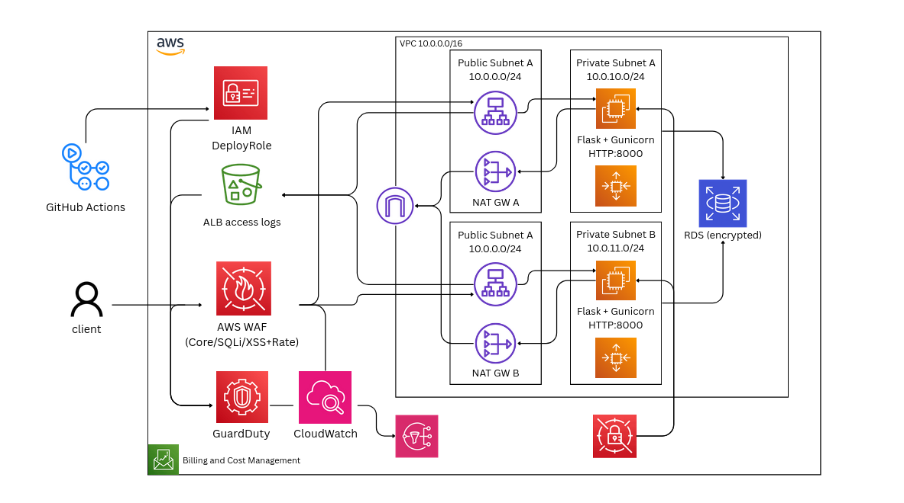
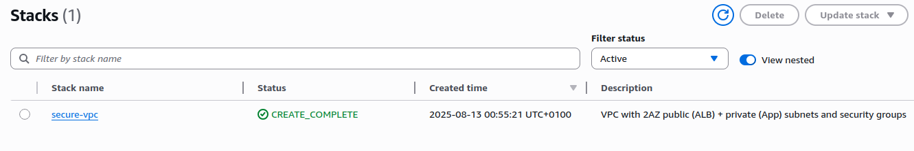
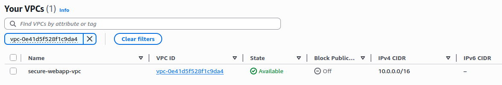
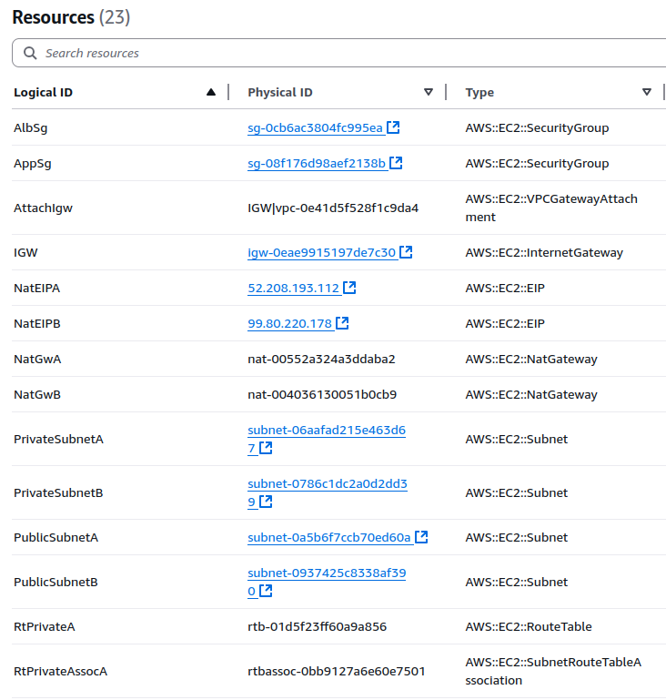
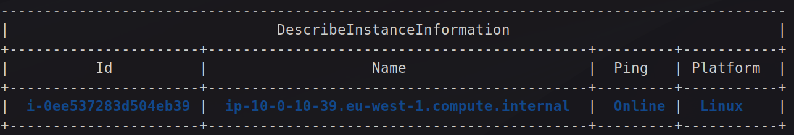
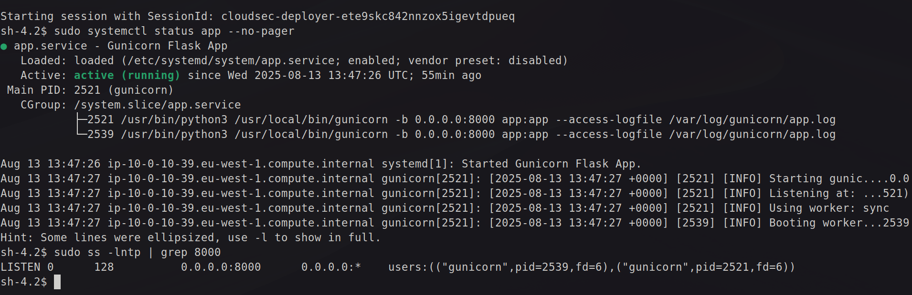
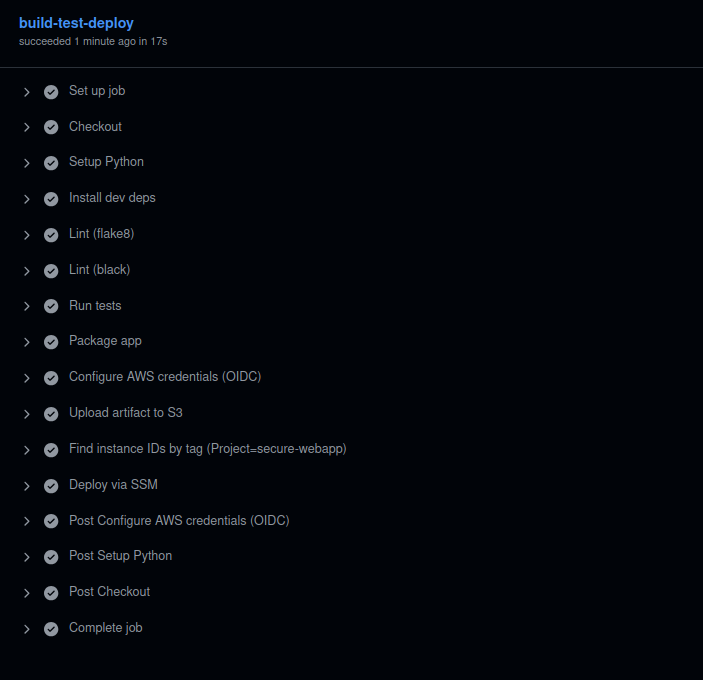
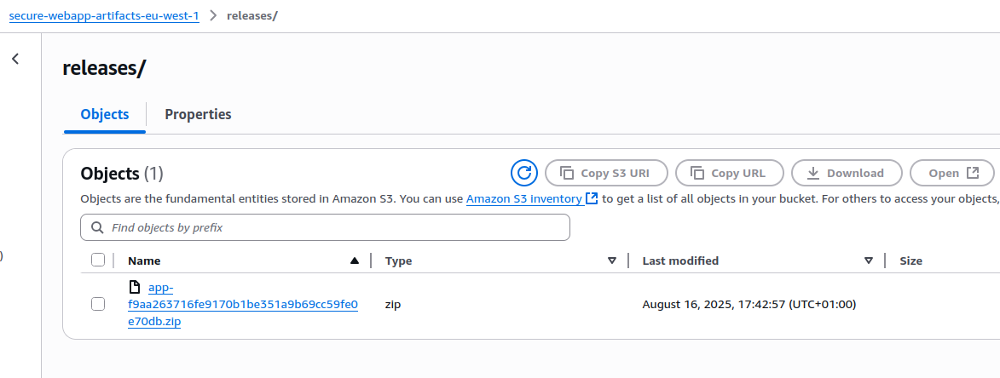

# Secure Web App on AWS 

This project was developed to design, implement, and validate a secure, production-ready template for a secure web app hosted on AWS. Using modern cloud-native practices. The main objective was to establish an environment that adheres to security best practices while remaining cost-effective and automation-driven.  

The deployment was carried out in a step-by-step manner, from building a minimal application service with Flask to provisioning a secure VPC. The configuration implements modern security best practices, emphasizing:

- Principle of least privilege for all access
- Access control enforced via IAM roles and bucket policies
- Encryption of data in transit and at rest
- Security headers (CSP, HSTS, XSS protection)
- Secure CI/CD pipeline using GitHub Actions
- Continuous monitoring and manual security testing

## Project Plan
Over 8 days, the objective was to create a secure web application on AWS with a focus on security and cloud engineering best practices. The plan was the following:

  >Day 1: Planning & IaC Basics\
  >Day 2: EC2 Deployment\
  >Day 3: Flask Application Setup\
  >Day 4: Network Security\
  >Day 5: Python Automation\
  >Day 6: CI/CD with GitHub Actions\
  >Day 7: CloudWatch Monitoring\
  >Day 8: Security Validation & Documentation

## Implementation Details
The project was structured to progressively enhance deployment processes, enforce robust access controls, automate infrastructure management, and strengthen the overall security posture. The following summary highlights the main stages of development and the rationale behind critical architectural and operational choices:

#### Day 1 – Planning & IaC Basics
  - Designed the AWS architecture.
  - Created a GitHub repository for version control and collaboration.
  - Established a basic folder structure for the project.
  - Created the base CloudFormation template for VPC, subnets, Internet Gateway, and Security Groups.


### Day 2 – EC2 Deployment via CloudFormation
  - Extended CloudFormation to:
    - Launch an EC2 instance with Amazon Linux 2
    - Attach IAM role with least privilege for SSM and CloudWatch
  - Validated deployment and connectivity (restricted by IP).

#### Day 3 – Flask Application Setup
  - Installed Python, Flask, and dependencies on EC2.
  - Created a simple Flask app with:
    - / route for home
    - /health endpoint for monitoring
  - Tested locally on the EC2 instance.


### Day 4 – Network Security
  - Locked down Security Groups:
    - Allow inbound HTTP/HTTPS only from ALB or your IP.
    - Restrict SSH to your IP only.
  - Configured VPC to ensure EC2 is in a private subnet with NAT gateway for outbound traffic.
  - Enable AWS WAF on the ALB with OWASP Top 10 rules.

### Day 5 – Python Automation
  - Wrote a user data script or Ansible/SSM document to:
    - Install Python, dependencies, and Flask
    - Configure systemd service for Flask app
    - Set up Nginx reverse proxy with SSL (ACM certificate via ALB)
  - Deployed automation through CloudFormation - manually at this moment.

### Day 6 – CI/CD with GitHub Actions
  - Created GitHub Actions workflow:
    - Lint Python code (flake8 / black)
    - Run unit tests
    - Package app
    - Deploy to EC2 via SSM or CodeDeploy (no SSH keys, OIDC IAM role)
  - Added branch protection to main.

### Day 7 – CloudWatch Monitoring
  - Enabled CloudWatch Logs for Flask app and Nginx.
  - Seted up CloudWatch Alarms for:
    - High CPU usage
    - HTTP 5xx errors from ALB
  - Created SNS topic for alerts (email notification).

### Day 8 – Security Validation & Documentation
  - Tested:
    - Blocked direct EC2 access
    - WAF rules triggering
    - IAM role least privilege
    - CI/CD deployment success
  - Wrote README.md and full security report

---

## Day 1

The first day of the project focused on establishing the development environment, initializing version control, and laying the foundation for the cloud infrastructure. A dedicated GitHub repository was created to centralize source code, CI/CD automation, and Infrastructure as Code templates.

As an initial workload, a minimal Flask application was implemented with two endpoints:  
- `/health` – designed for infrastructure-level checks and integration with load balancers or monitoring systems.  
- `/` – serving as a basic smoke test endpoint for end users or monitoring agents.  

From the outset, the application included essential HTTP security headers (`X-Frame-Options`, `X-Content-Type-Options`, and `Referrer-Policy`), following OWASP guidelines to mitigate common web threats such as clickjacking and MIME sniffing. This ensured that security was embedded at the earliest stage of development.

```bash
curl -s http://127.0.0.1:8000/health | jq
curl -i http://127.0.0.1:8000/ | sed -n '1,20p'   # show headers
{
  "status": "ok"
}
  % Total    % Received % Xferd  Average Speed   Time    Time     Time  Current
                                 Dload  Upload   Total   Spent    Left  Speed
100    64  100    64    0     0  21805      0 --:--:-- --:--:-- --:--:-- 32000
HTTP/1.1 200 OK
Server: Werkzeug/3.1.3 Python/3.10.12
Date: Mon, 11 Aug 2025 21:31:34 GMT
Content-Type: application/json
Content-Length: 64
X-Frame-Options: DENY
X-Content-Type-Options: nosniff
```


In parallel, the target architecture was designed. It includes a **dedicated Virtual Private Cloud (VPC)** with a CIDR block of `10.0.0.0/16`, split across two Availability Zones for resilience. The design enforces clear separation of concerns:  
- **Public subnets** host the Application Load Balancer (ALB) and NAT Gateways.  
- **Private subnets** host the EC2 instances running the application.  
- **Internet Gateway** provides ingress/egress for public subnets, while private subnets rely on **NAT Gateways** for secure outbound traffic.  

This model limits exposure of application servers directly to the internet while maintaining high availability and scalability.



To codify the design, an **IaC template** (`vpc.yaml`) was created to provision the VPC, subnets, route tables, Internet Gateway, and Security Groups. In support of secure automation, a dedicated IAM role (`cloudsec-deployer`) was created with strictly scoped permissions for CloudFormation and EC2 networking actions, restricted to the project’s deployment region. This role enforces the principle of least privilege, ensuring only required actions can be performed during deployments.

Validation steps were carried out to confirm the IAM role permissions and template integrity before deployment. The VPC stack was then deployed successfully through CloudFormation, creating the foundational network environment with properly tagged resources for easier identification and governance.

```bash
aws sts get-caller-identity --profile cloudsec-deployer
aws cloudformation validate-template --template-body file://iac/vpc.yaml --profile cloudsec-deployer --region eu-west-1
{
    "UserId": "AIDA********",
    "Account": "<user_id>",
    "Arn": "arn:aws:iam::<user_id>:user/cloudsec-deployer"
}
{
    "Parameters": [
        {
            "ParameterKey": "ProjectName",
            "NoEcho": false
        },
        {
            "ParameterKey": "AzB",
            "NoEcho": false
        },
        {
            "ParameterKey": "CidrBlock",
            "DefaultValue": "10.0.0.0/16",
            "NoEcho": false
        },
        {
            "ParameterKey": "AzA",
            "NoEcho": false
        }
    ],
    "Description": "VPC with 2AZ public (ALB) + private (App) subnets and security groups"
}
```
The IAM role was confirmed active and authorized.

Once checked the tags in the VPC, subnets, and IGW in the `vpc.yml` file to help identify resources later.

The VPC stack was deployed using the following command:
```bash
aws cloudformation deploy \
  --template-file iac/vpc.yaml \
  --stack-name secure-vpc \
  --parameter-overrides ProjectName=secure-webapp AzA=eu-west-1a AzB=eu-west-1b \
  --region eu-west-1 --profile cloudsec-deployer \
  --no-fail-on-empty-changeset
```
**Deployment completed successfully:**

Stack creation confirmed via CloudFormation console:


VPC created with associated subnets and Internet Gateway:


Resource list showing all provisioned components:


## Day 2 & Day 3

On the second and third days, the focus shifted to provisioning the compute layer and deploying the Flask application into a secure runtime environment. An **Infrastructure as Code template (`compute.yaml`)** was created to define and provision the necessary resources. This included:  

- An IAM role and instance profile with **least-privilege permissions**, granting only the ability to interact with AWS Systems Manager (SSM) and CloudWatch Logs.  
- A CloudWatch Log Group dedicated to application logs, supporting centralized monitoring.  
- An EC2 instance provisioned in the private subnet, explicitly configured to enforce **IMDSv2** (Instance Metadata Service v2) to mitigate the risk of server-side request forgery (SSRF) attacks.  
- UserData that installed Python, the CloudWatch Agent, and deployed the Flask application under Gunicorn as the production server.  

For the operating system, **Amazon Linux 2 (64-bit x86, HVM, SSD)** was selected as it falls under the AWS free tier, comes with the SSM Agent pre-installed, and is broadly supported for production workloads.


#### Security Considerations
Several safeguards were incorporated at this stage to strengthen the EC2 environment:  
- **IMDSv2 Enforced** – ensuring token-based access to the instance metadata service, with a hop limit set to prevent SSRF pivoting.  
- **No Public Exposure** – the instance was launched without an Elastic IP or public IP. Inbound traffic was restricted to the Application Load Balancer’s Security Group on port 8000.  
- **Least-Privilege IAM Role** – the instance profile was restricted to only the actions necessary for logging and session management.  
- **No Secrets in UserData** – deployment avoided embedding credentials or sensitive data in the launch configuration.  

#### Storage and Encryption
For persistent storage, the default **EBS encryption** was enabled at the account level. This ensures that all newly created EBS volumes, including the operating system disk, are encrypted by default. This configuration aligns with AWS best practices for data-at-rest protection, without requiring manual volume encryption at each deployment.


Relied on the default EBS encryption for the EC2 instance for now
since it was deactivated, I turned it on with
aws ec2 enable-ebs-encryption-by-default
making sure the policy for cloudsec-deployer has the permission:
```yaml
"ec2:EnableEbsEncryptionByDefault",
```

Deployed the `compute.yaml` and checked the resources created.


#### Deployment and Verification
Once the template was deployed, the EC2 instance was successfully created and verified to be running. Access to the instance was conducted securely via **AWS Systems Manager Session Manager**, eliminating the need for SSH keys or public network exposure.



Started the instance and checked the SSM connection:
```bash
# Start a shell (no SSH needed)
aws ssm start-session --target i-0ee537283d504eb39 \
  --region eu-west-1 --profile cloudsec-deployer
```


The Flask service was validated locally within the SSM session to confirm application availability on port 8000:  
- `/health` returned the expected infrastructure health status.  
- `/` returned the application’s JSON response.  

```bash
sh-4.2$ curl -s localhost:8000/health
{"status":"ok"}
sh-4.2$ curl -s localhost:8000/
{"message":"hello from private ec2"}
```
It was working fine.


#### Logging and Monitoring
CloudWatch integration was verified to ensure that application logs were captured. Log streams were created automatically for the instance under `/secure-webapp/app`. Requests made against the Flask application appeared in the Gunicorn logs, confirming end-to-end visibility of traffic and application activity.

```bash
aws logs describe-log-streams \
  --log-group-name "/secure-webapp/app" \
  --log-stream-name-prefix "$INSTANCE_ID" \
  --query "logStreams[].logStreamName" --output table \
  --region eu-west-1 --profile cloudsec-deployer

aws logs get-log-events \
  --log-group-name "/secure-webapp/app" \
  --log-stream-name "$INSTANCE_ID/gunicorn" \
  --limit 20 --region eu-west-1 --profile cloudsec-deployer \
  --query "events[].message"
------------------------------------
|        DescribeLogStreams        |
+----------------------------------+
|  i-0ee537283d504eb39/cloud-init  |
|  i-0ee537283d504eb39/gunicorn    |
|  i-0ee537283d504eb39/messages    |
+----------------------------------+
[
    "127.0.0.1 - - [13/Aug/2025:14:44:30 +0000] \"GET /health HTTP/1.1\" 200 16 \"-\" \"curl/8.3.0\"",
    "127.0.0.1 - - [13/Aug/2025:14:44:32 +0000] \"GET / HTTP/1.1\" 200 37 \"-\" \"curl/8.3.0\""
]
```


## Day 4 & Day 5

Billing alerts from the AWS Billing and Cost Management Dashboard revealed higher-than-expected charges, primarily driven by the NAT Gateway. This triggered an immediate review of project costs and architecture.

A key lesson learned was the importance of analyzing and estimating the project budget before provisioning infrastructure. NAT Gateways, while convenient for secure outbound connectivity, are expensive for continuous development environments.

#### Cost Mitigation Actions

The running EC2 instance was shut down and the CloudFormation stack was temporarily deleted to stop accruing costs.

**Interim Architecture (No NAT)**

To reduce costs while still allowing development work, the NAT Gateway was deactivated. Instead, the EC2 instance was placed into a public subnet with a Security Group locked down to the developer’s IP.

- Inbound access: Allowed only on TCP/8000 from the developer’s IP.
- SSH: Disabled (AllowSshFromDev=false) to reduce attack surface.

This approach is less secure than a private subnet behind an ALB + NAT, but acceptable for temporary development while cost optimization is prioritized.

CloudFormation templates (`compute_no_nat.yaml`, `vpc_no_nat.yaml`) were created accordingly to support a no-NAT, public subnet architecture for development mode.

#### CloudFormation Changes

**Compute Template**

- EC2 Instance: Launches in a public subnet.
- IAM Role: Includes `AmazonSSMManagedInstanceCore` and `CloudWatchAgentServerPolicy` for remote management and logging.
- Bootstrap (UserData):
    - Installs Python, Flask, Gunicorn, and Nginx.
    - Creates `/opt/app/app.py` with a simple health endpoint.
    - Defines a systemd service (`flaskapp.service`) for Gunicorn, ensuring Flask runs automatically on boot.

**VPC Template**

- Two public subnets with Internet Gateway routing.
- Route table sends 0.0.0.0/0 to the IGW.
- Security Group:
  - Allows TCP/8000 only from the developer’s IP.
  - SSH disabled unless explicitly toggled via parameter (AllowSshFromDev).

This setup reduced costs by removing the NAT Gateway but still enabled testing through controlled inbound access.

#### Validation and Evidence

The running EC2 instance was confirmed with both private and public IPs:
```bash
aws ec2 describe-instances --instance-ids "$INSTANCE_ID" \
  --query 'Reservations[0].Instances[0].[State.Name,PublicIpAddress,PrivateIpAddress,SubnetId]' \
  --output table --region "$REGION" --profile "$PROFILE"

------------------------------
|      DescribeInstances     |
+----------------------------+
|  running                   |
|  3.252.147.213             |
|  10.0.1.242                |
|  subnet-07526fd06f2180be2  |
+----------------------------+
```

The EC2 instance was confirmed as i-032b3f84c375a5329 within the stack secure-compute-dev:
```bash
aws cloudformation describe-stack-resources \
  --stack-name secure-compute-dev \
  --query "StackResources[?ResourceType=='AWS::EC2::Instance'].[LogicalResourceId,PhysicalResourceId]" \
  --output table --region "$REGION" --profile "$PROFILE"

----------------------------------------
|        DescribeStackResources        |
+--------------+-----------------------+
|  EC2Instance |  i-032b3f84c375a5329  |
+--------------+-----------------------+
```

#### Subnet and Routing

Subnet configuration verified that the instance was in a public subnet with `MapPublicIpOnLaunch=True` and a default route via the IGW.

Confirmed that inbound access was limited to TCP/8000 from a single developer IP:
```bash
aws ec2 describe-security-groups --group-ids "$APP_SG" \
  --query "SecurityGroups[0].IpPermissions" --output json \
  --region "$REGION" --profile "$PROFILE"

    {
        "IpProtocol": "tcp",
        "FromPort": 8000,
        "ToPort": 8000,
        "UserIdGroupPairs": [],
        "IpRanges": [
            {
                "CidrIp": "<developer_ip>/32"
            }
        ],
        "Ipv6Ranges": [],
        "PrefixListIds": []
    }

```
No SSH access was allowed (`AllowSshFromDev=false`).

#### Application Deployment

An initial Flask application was deployed manually into `/opt/app`:

```bash
aws ssm start-session --target i-032b3f84c375a5329   --region eu-west-1 --profile cloudsec-deployer

Starting session with SessionId: cloudsec-deployer-<session-id>
sh-4.2$ sudo bash -lc 'cat >/opt/app/app.py << "PY"
> from flask import Flask, jsonify
> app = Flask(__name__)
> 
> @app.after_request
> def set_headers(resp):
>     resp.headers["X-Frame-Options"] = "DENY"
>     resp.headers["X-Content-Type-Options"] = "nosniff"
>     resp.headers["Strict-Transport-Security"] = "max-age=31536000; includeSubDomains; preload"
>     resp.headers["Content-Security-Policy"] = "default-src '\''self'\''"
>     resp.headers["Referrer-Policy"] = "no-referrer"
>     return resp
> 
> @app.get("/health")
> def health():
>     return "OK", 200
> 
> @app.get("/")
> def index():
>     return jsonify(message="hello from private ec2"), 200
> PY
> 
> # restart & verify
> systemctl restart app.service
> sleep 1
> systemctl --no-pager --full status app.service | sed -n "1,12p"
> ss -lntp | grep :8000 || true
> echo; echo "health:"; curl -s localhost:8000/health
> echo; echo "root:";   curl -s localhost:8000/
> '
Failed to restart app.service: Unit not found.
Unit app.service could not be found.
LISTEN 0      2048         0.0.0.0:8000      0.0.0.0:*    users:(("gunicorn",pid=10160,fd=5),("gunicorn",pid=10159,fd=5),("gunicorn",pid=10147,fd=5))

health:
OK
root:
<!doctype html>
<html lang=en>
<title>404 Not Found</title>
<h1>Not Found</h1>
<p>The requested URL was not found on the server. If you entered the URL manually please check your spelling and try again.</p>
```

Since the initial flaskapp.service failed, a proper systemd unit file (`/etc/systemd/system/app.service`) was created for Gunicorn.

Key features:
- Runs Gunicorn bound to 0.0.0.0:8000
- Logs written to `/var/log/gunicorn/app.log`.
- Restart policy enabled for resilience.

```bash
# 1) Ensure app code is in place (re-writes the same content just in case)
sh-4.2$ sudo bash -lc 'cat >/opt/app/app.py << "PY"
> from flask import Flask, jsonify
> app = Flask(__name__)
> 
> @app.after_request
> def set_headers(resp):
>     resp.headers["X-Frame-Options"] = "DENY"
>     resp.headers["X-Content-Type-Options"] = "nosniff"
>     resp.headers["Strict-Transport-Security"] = "max-age=31536000; includeSubDomains; preload"
>     resp.headers["Content-Security-Policy"] = "default-src '\''self'\''"
>     resp.headers["Referrer-Policy"] = "no-referrer"
>     return resp
> 
> @app.get("/health")
> def health():
>     return "OK", 200
> 
> @app.get("/")
> def index():
>     return jsonify(message="hello from private ec2"), 200
> PY
> '
sh-4.2$ 
sh-4.2$ # 2) Create a proper systemd unit for Gunicorn
sh-4.2$ sudo bash -lc 'cat >/etc/systemd/system/app.service << "UNIT"
> [Unit]
> Description=Gunicorn Flask App
> After=network.target
> 
> [Service]
> Type=simple
> WorkingDirectory=/opt/app
> ExecStart=/usr/local/bin/gunicorn -b 0.0.0.0:8000 app:app --access-logfile /var/log/gunicorn/app.log
> Restart=always
> RestartSec=5
> User=root
> 
> [Install]
> WantedBy=multi-user.target
> UNIT
> '
sh-4.2$ 
sh-4.2$ # 3) Ensure log directory exists
sh-4.2$ sudo mkdir -p /var/log/gunicorn
sh-4.2$ sudo chmod 755 /var/log/gunicorn
sh-4.2$ 
sh-4.2$ # 4) Stop any stray gunicorn processes (free the port)
sh-4.2$ sudo pkill -f "[g]unicorn" || true
sh-4.2$ 
sh-4.2$ # 5) Start via systemd and enable on boot
sh-4.2$ sudo systemctl daemon-reload
sh-4.2$ sudo systemctl enable app.service
Created symlink from /etc/systemd/system/multi-user.target.wants/app.service to /etc/systemd/system/app.service.
sh-4.2$ sudo systemctl start app.service
sh-4.2$ 
sh-4.2$ # 6) Quick checks
sh-4.2$ sleep 1
sh-4.2$ sudo systemctl --no-pager --full status app.service | sed -n "1,15p"
● app.service - Gunicorn Flask App
   Loaded: loaded (/etc/systemd/system/app.service; enabled; vendor preset: disabled)
   Active: active (running) since Thu 2025-08-14 18:29:12 UTC; 1s ago
 Main PID: 4709 (gunicorn)
   CGroup: /system.slice/app.service
           ├─4709 /usr/bin/python3 /usr/local/bin/gunicorn -b 0.0.0.0:8000 app:app --access-logfile /var/log/gunicorn/app.log
           └─4716 /usr/bin/python3 /usr/local/bin/gunicorn -b 0.0.0.0:8000 app:app --access-logfile /var/log/gunicorn/app.log

Aug 14 18:29:12 ip-10-0-1-242.eu-west-1.compute.internal systemd[1]: Started Gunicorn Flask App.
Aug 14 18:29:12 ip-10-0-1-242.eu-west-1.compute.internal gunicorn[4709]: [2025-08-14 18:29:12 +0000] [4709] [INFO] Starting gunicorn 23.0.0
Aug 14 18:29:12 ip-10-0-1-242.eu-west-1.compute.internal gunicorn[4709]: [2025-08-14 18:29:12 +0000] [4709] [INFO] Listening at: http://0.0.0.0:8000 (4709)
Aug 14 18:29:12 ip-10-0-1-242.eu-west-1.compute.internal gunicorn[4709]: [2025-08-14 18:29:12 +0000] [4709] [INFO] Using worker: sync
Aug 14 18:29:12 ip-10-0-1-242.eu-west-1.compute.internal gunicorn[4709]: [2025-08-14 18:29:12 +0000] [4716] [INFO] Booting worker with pid: 4716
sh-4.2$ ss -lntp | grep :8000 || true
LISTEN 0      2048         0.0.0.0:8000      0.0.0.0:*          
sh-4.2$ echo; echo "health:"; curl -s localhost:8000/health

health:
OKsh-4.2$ echo; echo "root:";   curl -s localhost:8000/

root:
{"message":"hello from private ec2"}
```
The app was confirmed healthy on /health, the application root returned the expected JSON response and the security headers were correctly injected.

## Day 6

The focus shifted to establishing a secure and automated deployment pipeline. The objective was to enable GitHub Actions to build, test, package, and deploy the application to AWS without storing long-lived credentials. This was achieved by combining **GitHub OIDC Federation**, **AWS IAM Roles**, and **SSM-based deployment**.

#### Deployment Script (SSM)

A deployment helper script (`ssm_deploy.sh`) was created to run directly on the EC2 instance. It downloads the latest release from the S3 artifacts bucket, unpacks it to `/opt/app`, installs dependencies if present, and restarts the application service managed by systemd.

```bash
#!/usr/bin/env bash
set -euo pipefail

BUCKET="${1:?bucket}"
KEY="${2:?key}"

echo "[deploy] downloading s3://$BUCKET/$KEY"
mkdir -p /opt/app/releases
aws s3 cp "s3://$BUCKET/$KEY" /opt/app/releases/app.zip

echo "[deploy] unpack to /opt/app"
rm -rf /opt/app/*
unzip -q /opt/app/releases/app.zip -d /opt/app

if [[ -f /opt/app/requirements.txt ]]; then
  python3 -m pip install --upgrade pip
  python3 -m pip install -r /opt/app/requirements.txt
fi

if systemctl is-enabled app.service >/dev/null 2>&1; then
  systemctl restart app.service
else
  echo "[deploy] WARNING: app.service not enabled"
fi

echo "[deploy] done."
```
This script enforces idempotent deployments (always replacing old code), ensures dependencies are consistent, and integrates cleanly with systemd for application lifecycle management.

#### GitHub Actions Workflow
A GitHub Actions workflow (`ci-cd.yml`) was created to handle linting, testing, packaging, artifact upload, and deployment. It uses OIDC to assume the AWS role `github-actions-deployer`, ensuring no static credentials are stored in the repository.

```yaml
name: ci-cd

on:
  push:
    branches: [ "main" ]
  pull_request:
    branches: [ "main" ]
  workflow_dispatch: {}

permissions:
  contents: read
  id-token: write

env:
  AWS_REGION: eu-west-1
  ROLE_ARN: arn:aws:iam::<account_id>:role/github-actions-deployer
  ARTIFACT_BUCKET: secure-webapp-artifacts-eu-west-1
  APP_DIR: app
  ZIP_NAME: app-${{ github.sha }}.zip

jobs:
  build-test-deploy:
    runs-on: ubuntu-latest

    steps:
      - uses: actions/checkout@v4

      - uses: actions/setup-python@v5
        with:
          python-version: "3.11"

      - name: Lint & Test
        run: |
          pip install --upgrade pip
          pip install black flake8 pytest
          flake8 $APP_DIR
          black --check $APP_DIR
          pytest -q || echo "No tests yet."

      - name: Package app
        run: |
          mkdir -p dist
          zip -r "dist/${ZIP_NAME}" "$APP_DIR" requirements.txt scripts/ssm_deploy.sh

      - name: Configure AWS credentials (OIDC)
        uses: aws-actions/configure-aws-credentials@v4
        with:
          role-to-assume: ${{ env.ROLE_ARN }}
          aws-region: ${{ env.AWS_REGION }}

      - name: Upload artifact to S3
        run: aws s3 cp "dist/${ZIP_NAME}" "s3://${ARTIFACT_BUCKET}/releases/${ZIP_NAME}"

      - name: Deploy via SSM
        run: |
          IDS=$(aws ec2 describe-instances \
            --filters "Name=tag:Project,Values=secure-webapp" "Name=instance-state-name,Values=running" \
            --query "Reservations[].Instances[].InstanceId" --output text)
          if [ -n "$IDS" ]; then
            aws ssm send-command \
              --document-name "AWS-RunShellScript" \
              --targets "Key=InstanceIds,Values=$IDS" \
              --comment "Secure webapp deploy $GITHUB_SHA" \
              --parameters commands='[
                "chmod +x /opt/app/scripts/ssm_deploy.sh",
                "/opt/app/scripts/ssm_deploy.sh '${ARTIFACT_BUCKET}' releases/${ZIP_NAME}"
              ]'
          fi
```
Key design decisions:
- OIDC Federation: Eliminates hardcoded AWS keys, improving security posture.
- Artifact Bucket: A dedicated, private, encrypted S3 bucket stores build artifacts with lifecycle policies to manage cost.
- SSM Deployments: Avoids SSH; deployments are run securely over AWS Systems Manager.
- Static Analysis: Checkov runs on CloudFormation templates, with SARIF reports optionally uploaded to GitHub Advanced Security for visibility.
- Branch Protection: Enabled the protection for the main branch
protected main : (require PRs, require status checks “ci-cd / build-test-deploy” to pass, dismiss stale reviews, etc.).

#### Branch Protection
To ensure only verified code reaches production, the `main` branch was protected with:

- Required pull requests.
- Required status checks (`iac-scan`, `build-test-deploy`).
- Dismissal of stale reviews.
- Linear history enforced.
- Force pushes and branch deletions disallowed.

```bash
gh api \
  -X PUT \
  -H "Accept: application/vnd.github+json" \
  repos/leandrocosta-git/secure-web-app/branches/main/protection \
  --input - <<'JSON'
{
  "required_status_checks": {
    "strict": true,
    "contexts": [
      "ci-cd / iac-scan",
      "ci-cd / build-test-deploy"
    ]
  },
  "enforce_admins": true,
  "required_pull_request_reviews": {
    "dismiss_stale_reviews": true,
    "required_approving_review_count": 1
  },
  "restrictions": null,
  "required_linear_history": true,
  "allow_force_pushes": false,
  "allow_deletions": false,
  "block_creations": false
}
JSON
```

Branch protection was configured via the GitHub CLI (`gh api`) to ensure reproducibility and auditable configuration management. The applied JSON policy enforces administrative oversight, required status checks, and review policies, thereby embedding governance directly into the version control system.

To address security risks from untrusted contributions, a fork-safe split was implemented: trusted runs (`iac-scan`) are separated from fork-based runs (`iac-scan-fork`). Fork jobs are executed with reduced privileges—no write permissions and no SARIF uploads—to prevent both secret leakage and the common “Resource not accessible by integration” error. Deployment jobs (`build-test-deploy`) were restricted to trusted events only, meaning they execute exclusively on `push` or `workflow_dispatch` events, never on pull requests.

The workflow itself was further hardened through strict permission scoping. Global permissions were kept to a minimum, and job-level permissions were only granted where explicitly required (e.g., `security-events: write` for SARIF upload jobs and id-token: write for OIDC role assumption with AWS). Concurrency controls were applied to prevent overlapping deployments to the `main` branch. Finally, packaging was adjusted to ensure that the ZIP artifact included both the `app/` directory and `requirements.txt`, aligning with the repository’s structure.

#### Setup:
The secure deployment environment was prepared with the following steps:

- Provisioned a private, encrypted S3 bucket with lifecycle policies to store build artifacts.
- Created an IAM role for GitHub Actions (github-actions-deployer) with a least-privilege deployment policy.
- Tagged the EC2 deployment instance with Project=secure-webapp to ensure proper targeting of deployments:

  ```bash
  aws ec2 create-tags \
    --resources i-032b3f84c375a5329 \
    --tags Key=Project,Value=secure-webapp \
    --region eu-west-1 --profile cloudsec-deployer
  ```
- Applied workflow restrictions in `ci-cd.yml`, granting only the minimal required permissions. Full Checkov scans and SARIF uploads are executed only when the event is trusted (push or same-repo PR). Forked PRs run in a restricted job configuration without write access or SARIF uploads.

#### GitHub Advanced Security (GHAS) Integration

Static analysis via Checkov was integrated into the workflow with optional SARIF uploads to GitHub Advanced Security (GHAS). Initially, SARIF uploads failed because GHAS was not enabled at the repository level. To avoid false negatives in the pipeline, the SARIF upload step was made **non-blocking**, allowing Checkov scans to succeed while preventing the job from failing unnecessarily.

The recommended action is to enable GitHub Code Scanning under `Settings → Security → Code security and analysis`. Once enabled, SARIF uploads will successfully populate the “`Code scanning alerts`” dashboard under the repository’s Security tab. At that point, the SARIF upload step can be switched back to mandatory, ensuring visibility and enforcement of detected misconfigurations.

#### Validation
Before enabling the deployment workflow, the following preconditions were audited:

1) S3 Artifact Bucket Exists

2) OIDC role github-actions-deployer exists and has the secure-webapp-gha-deploy policy attached

3) EC2 Target(s) was running & tagged `Project=secure-webapp`; SSM Online

```bash
# --- Config (edit if needed) ---
PROFILE=cloudsec-deployer
REGION=eu-west-1
BUCKET=secure-webapp-artifacts-eu-west-1
ROLE_NAME=github-actions-deployer
REQ_POLICY_NAME=secure-webapp-gha-deploy
PROJECT_TAG=secure-webapp

echo "== 1) S3 bucket exists & is reachable =="
aws s3 ls "s3://${BUCKET}" --profile "$PROFILE" && echo "OK: Bucket exists" || echo "MISSING: Create bucket ${BUCKET}"

echo
echo "== 2) OIDC deploy role exists and has the right policy attached =="

# Show role + trust policy summary
aws iam get-role --role-name "$ROLE_NAME" --profile "$PROFILE" \
  --query '{Role:Role.Arn,Trust:Role.AssumeRolePolicyDocument.Statement[0].Condition.StringEquals}' --output json

# Is the local policy attached?
ATTACHED=$(aws iam list-attached-role-policies --role-name "$ROLE_NAME" --profile "$PROFILE" \
  --query "AttachedPolicies[?PolicyName=='${REQ_POLICY_NAME}'].PolicyArn" --output text 2>/dev/null)

if [ -n "$ATTACHED" ]; then
  echo "OK: Policy ${REQ_POLICY_NAME} is attached -> ${ATTACHED}"
else
  echo "MISSING: Attach policy ${REQ_POLICY_NAME} to role ${ROLE_NAME}"
  echo "If you know the ARN, run:"
  echo "  aws iam attach-role-policy --role-name ${ROLE_NAME} --policy-arn arn:aws:iam::$(aws sts get-caller-identity --query Account --output text --profile $PROFILE):policy/${REQ_POLICY_NAME} --profile $PROFILE"
fidone--output table --region "$REGION" --profile "$PROFILE"rofile.{Arn:Arn,Id:Id}" \ceId,
== 1) S3 bucket exists & is reachable ==
OK: Bucket exists

== 2) OIDC deploy role exists and has the right policy attached ==
{
    "Role": "arn:aws:iam::<user_id>:role/github-actions-deployer",
    "Trust": {
        "token.actions.githubusercontent.com:aud": "sts.amazonaws.com",
        "token.actions.githubusercontent.com:sub": "repo:leandrocosta-git/secure-web-app:ref:refs/heads/main"
    }
}
OK: Policy secure-webapp-gha-deploy is attached -> arn:aws:iam::<user_id>:policy/secure-webapp-gha-deploy

== 3) At least one running EC2 instance with tag Project=secure-webapp ==
------------------------------------------------------------------
|                        DescribeInstances                       |
+----------------------+------------+----------------------------+
|          Id          |   Name     |          Subnet            |
+----------------------+------------+----------------------------+
|  i-032b3f84c375a5329 |  -instance |  subnet-07526fd06f2180be2  |
+----------------------+------------+----------------------------+
||                              SGs                             ||
|+--------------------------------------------------------------+|
||  sg-0b753284caef5cc18                                        ||
|+--------------------------------------------------------------+|
OK: Found instance(s): i-032b3f84c375a5329

== 3a) Confirm SSM is online for those instance(s) (so Deploy step can work) ==
----------------------------------------------------------
|               DescribeInstanceInformation              |
+----------+---------------------------------------------+
|  Id      |  i-032b3f84c375a5329                        |
|  Name    |  ip-10-0-1-242.eu-west-1.compute.internal   |
|  Ping    |  Online                                     |
|  Platform|  Linux                                      |
+----------+---------------------------------------------+

== 3b) (Optional) Show IAM instance profile attached to each instance ==
-- i-032b3f84c375a5329
-------------------------------------------------------------------------------------------------------
|                               DescribeIamInstanceProfileAssociations                                |
+-----+-----------------------------------------------------------------------------------------------+
|  Arn|  arn:aws:iam::<user_id>:instance-profile/secure-compute-dev-InstanceProfile-jauQhHrtUYKI   |
|  Id |  AIPA******                                                                        |
+-----+-----------------------------------------------------------------------------------------------+
```
The S3 bucket was successfully provisioned, confirming that the pipeline can upload build artifacts. The OIDC role with the appropriate policy was attached, ensuring that GitHub Actions can assume the role securely. The EC2 instance was located and confirmed to be online with SSM enabled, which guarantees that the deployment step can execute commands remotely.

Prior to merging, the setup was validated by manually triggering the workflow:

```bash
gh workflow run ci-cd.yml -f ref=ci/setup-ci
gh run watch
```

### Day 7
The seventh day focused on completing infrastructure security enhancements, improving observability, and finalizing deployment automation. The primary tasks were:

1. Migrating the application’s EC2 instance to a private subnet protected by a NAT Gateway.

2. Enabling AWS WAF on the Application Load Balancer (ALB), with OWASP Top 10 managed rules enabled by default.

3. Configuring CloudWatch Logs for both Flask (Gunicorn) and Nginx to ensure application and access logs are collected, encrypted, and retained.

4. Creating an SNS topic for alerting, to be subscribed to later by email or incident management systems.

5. Building an SSM automation document to streamline deployment, and extending the EC2 instance role to allow controlled read access to artifacts in S3.

#### Infrastructure Modifications

**Private Subnet with NAT Gateway**

The EC2 application instance was moved from a public subnet into a private subnet, with outbound internet access provided via a NAT Gateway. This improves security by removing the need for direct inbound public IPs on the instance. Instead, all traffic flows through the ALB, which now acts as the only exposed endpoint. The NAT Gateway allows outbound connectivity for updates, dependency installs, and external integrations.

**Justification**: Running workloads in private subnets is an AWS best practice aligned with the principle of least exposure. While NAT Gateways incur additional costs, they eliminate the attack surface of directly exposed instances.

**WAF on Application Load Balancer**

AWS WAF was enabled on the ALB, configured with the AWS Managed OWASP Top 10 ruleset by adding `waf` and `monitoring` YAMLs.

This provides immediate protection against common application-layer threats such as SQL injection, XSS, and command injection. Using managed rules reduces operational overhead, as AWS continuously maintains the ruleset.

It shifts security enforcement to the edge, protecting both the ALB and backend EC2 instance from malicious requests before they reach the application.

**CloudWatch Logging and KMS Encryption**

A CloudWatch Log Group (/${ProjectName}/app) was created, encrypted with a KMS key with rotation enabled. The following log streams are collected via the CloudWatch Agent:

Nginx access logs ({instance_id}/nginx-access)

Nginx error logs ({instance_id}/nginx-error)

Gunicorn application logs ({instance_id}/app)

Retention: Logs are retained for 30 days.
Justification: Centralized, encrypted log storage provides tamper-evident visibility into access patterns, errors, and application health, critical for incident response and compliance monitoring.

**SNS Topic for Alerts**

An SNS topic was provisioned for future integration with alerting systems. The topic will be subscribed by operational email addresses or routed into ticketing/incident response systems.

It ensures security and availability alerts can be delivered in real-time.


**CloudFormation Template Update**

An SSM automation document was created to automate the deployment process.
The `compute_nonat` CloudFormation template was updated with:
- A KMS key and alias for log encryption.
- A KMS-encrypted CloudWatch log group with 30-day retention.
- An IAM instance role and profile with SSM, CloudWatch Agent, and optional S3 artifact read access.
- A UserData bootstrap script installing Flask, Gunicorn, and Nginx, plus enabling the CloudWatch agent.
- Hardened HTTP headers (CSP, X-Frame-Options, etc.) applied in both Flask and Nginx.

This ensures the entire stack is reproducible, secure, and automated.

#### Validation and Evidence

Validation steps confirmed that all preconditions remained satisfied:

```bash
# S3 bucket exists
aws s3 ls s3://$BUCKET --profile $PROFILE >/dev/null && echo "S3 OK"

# OIDC deploy role & policy
aws iam get-role --role-name github-actions-deployer --profile $PROFILE --query Role.Arn
aws iam list-attached-role-policies --role-name github-actions-deployer --profile $PROFILE \
  --query "AttachedPolicies[].PolicyName" | grep -q secure-webapp-gha-deploy && echo "Role+Policy OK"

# Instance online & tagged (needed by deploy job)
aws ec2 describe-instances \
  --filters "Name=tag:Project,Values=secure-webapp" "Name=instance-state-name,Values=running" \
  --query "Reservations[].Instances[].InstanceId" --profile $PROFILE --region $REGION

# SSM reachable (deploy uses AWS-RunShellScript)
aws ssm describe-instance-information --profile $PROFILE --region $REGION \
  --query "InstanceInformationList[].{Id:InstanceId,Ping:PingStatus}"

# Validation
S3 OK
"arn:aws:iam::<user_id>:role/github-actions-deployer"
Role+Policy OK
[
    "i-032b3f84c375a5329"
]
[
    {
        "Id": "i-032b3f84c375a5329",
        "Ping": "Online"
    }
]
```

All GitHub Actions workflows were configured and validated successfully, ensuring automated builds, tests, and deployments are functioning as intended.



With this setup, a dedicated S3 bucket is now provisioned to securely store application ZIP artifacts. Deployments are performed automatically via AWS Systems Manager (SSM), enabling seamless, credential-free delivery of new application versions to EC2 instances. This approach ensures that build artifacts are managed centrally, deployments are auditable, and no manual intervention or SSH access is required.



#### Cost Considerations

By moving the instance into a private subnet and enabling WAF and NAT Gateway, recurring costs increased. The largest contributor is the NAT Gateway, followed by ALB hourly charges, WAF rule requests, and CloudWatch log ingestion.

Estimated cost during development: ~€5 (mainly NAT Gateway).

**Cost Management Recommendation:** Enable AWS Budgets with alerts configured via SNS to monitor spending, especially for NAT Gateway data transfer and WAF request charges.


## Deployment

When deploying, you might change the following variables:
```bash
export PROFILE=<your-profile>
export REGION=<your-region>
export STACK_VPC=secure-vpc-dev
export PROJECT=secure-webapp
#DEV_CIDR=YOUR.PUBLIC.IP.ADDR/32
export DEV_IP=$(curl -s https://checkip.amazonaws.com)
export DEV_CIDR=${DEV_IP%$'\n'}/32
export AZA=eu-west-1a
export AZB=eu-west-1b
export ACCESS_LOGS_BUCKET=secure-webapp-access-logs
```
But they are also asked in the next script.

Infrastructure deployment was automated with `deploy.sh`:
```bash
export ACM_ARN=""  # optional for HTTP tests
chmod +x deploy.sh
./deploy.sh
```

It is possible to delete all resources created by this project by running the provided cleanup scripts:
```bash
./destroy.sh
```
⚠️ **Important**: Always verify that all AWS resources have been fully removed after running these scripts. Residual resources (e.g., NAT Gateways, Load Balancers, WAF, or S3 buckets) may continue to incur costs if left behind.

No responsibility is assumed for any ongoing charges, it is the user’s responsibility to confirm that all billable resources have been terminated.

## Conclusion

By the end of this project, a secure and automated web application environment was successfully deployed on AWS. The infrastructure incorporated multiple layers of defense, from network segmentation and IMDSv2 enforcement on EC2 instances to CloudWatch-based monitoring and strict IAM role definitions. Sensitive operations such as deployments were executed without SSH access, relying instead on AWS Systems Manager for controlled and auditable changes.  


The CI/CD pipeline built with GitHub Actions demonstrated how OIDC integration with AWS can eliminate the risks of static credentials, while artifact management through private, encrypted S3 buckets provided a reliable distribution mechanism. Security checks, such as Checkov scans and GitHub branch protections, ensured that insecure configurations or unreviewed changes could not reach production.  

This project highlights how organizations can leverage AWS services not only to deploy applications at scale but also to embed **security into every layer of the development lifecycle**. The resulting template can serve as a reference for enterprise-grade deployments that strike a balance between agility and compliance, showcasing the value of combining DevOps automation with cloud security best practices.  